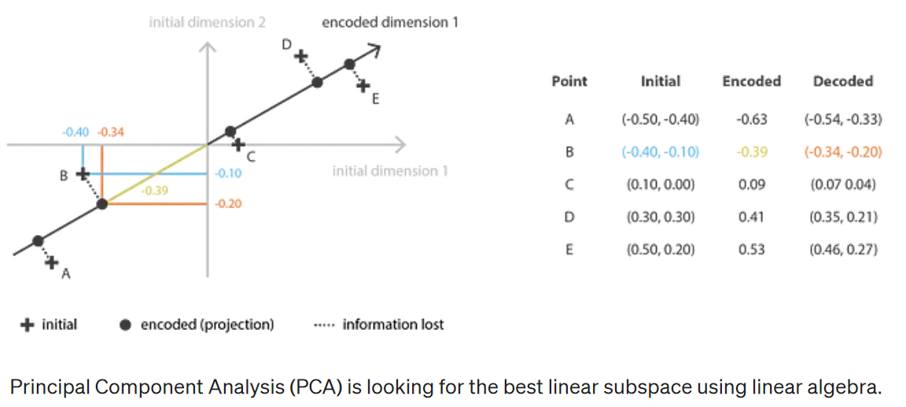

PCA（Principal components analysis）的思想是构建 n\_e **新的独立特征**，这些特征是 n\_d 旧特征的**线性组合**，以便这些新特征定义的子空间上的数据投影尽可能接近初始数据（以欧几里得距离表示）。

换句话说，PCA正在寻找初始空间的**最佳线性子空间**（由新特征的正交基描述），以便通过其在此子空间上的**投影**逼近数据的**误差**尽可能小。

