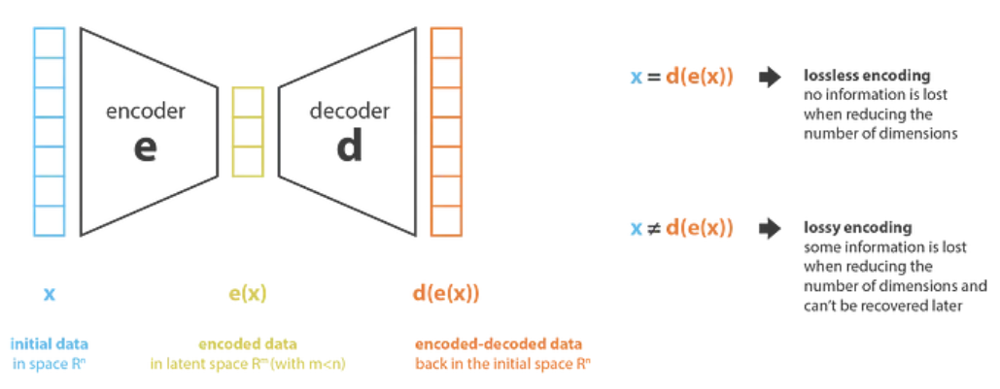
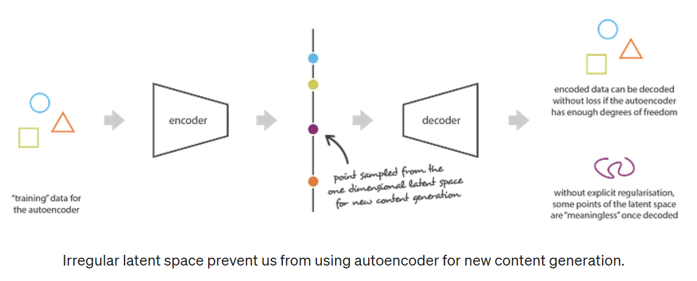
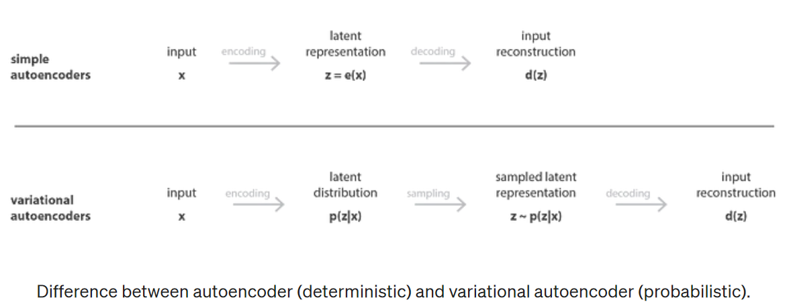
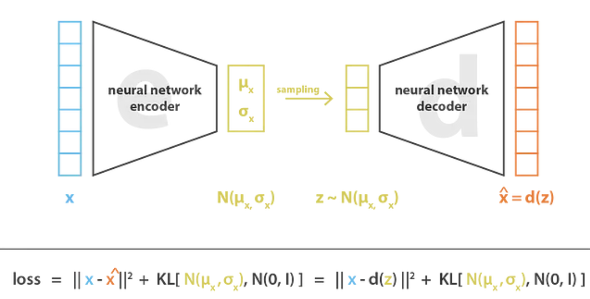
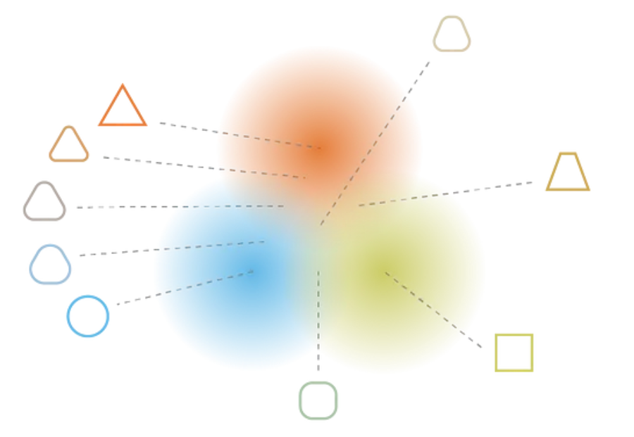
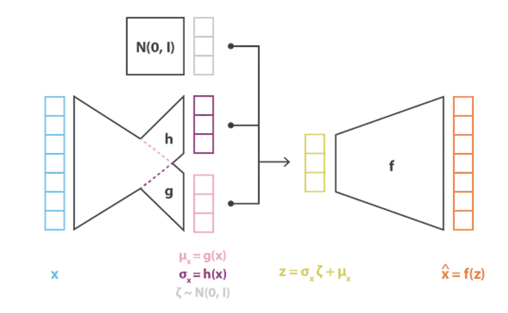

变分自编码器（Variational Auto-Encoder，VAE），希望构建一个从 **隐变量Z** 生成 **目标数据X** 的模型。更准确地讲，VAE是一个自动编码器，其编码分布在训练期间被正则化（正态分布），训练一个模型 $X=g(Z)$，这个模型能够将原来的概率分布映射到训练集的概率分布，以确保其潜在空间具有良好的属性，使我们能够生成一些新数据。 

### AE

encoder：从“旧特征”表示生成“新特征”表示，降维

decoder：encoder相反

找到一组最合适的编码解码器使得重建的数据与原始数据误差测量最小。

$$loss = \parallel{x-\hat{x}}\parallel^{2}=\parallel{x-d(z)}\parallel^{2}=\parallel{x-e(d(x))}\parallel^{2}$$

将编码器和解码器设置为**神经网络**并使用迭代优化过程学习最佳编码-解码方案，在每次迭代中，我们都会向**Auto-Encoder**架构（编码器后跟解码器）提供一些数据，我们将编码-解码输出与初始数据进行比较，并通过架构**反向传播**误差以更新网络的权重。

一旦自动编码器被训练，我们既有编码器又有解码器，但仍然没有真正的方法来产生任何**新内容**。乍一看，我们可能会认为，如果**潜在空间足够规则**（在训练过程中由编码器很好地“组织”），我们可以从该潜在空间中随机获取一个点并对其进行解码以获得新内容。然后，解码器的行为或多或少类似于生成对抗网络的生成器。然而，自动编码器的潜在空间的规律性是一个难题，它取决于初始空间中数据的分布、潜在空间的维度和编码器的架构。

### VAE

为了能够将自动编码器的解码器用于**生成目的**，我们必须确保潜在空间足够规则。获得这种规律性的一种可能的解决方案是在训练过程中引入**明确的正则化**。因此，变分自编码器可以定义为一个自动编码器，其训练被正则化以避免过度拟合并确保潜在空间具有良好的属性，从而实现生成过程。

为了引入一些潜在空间的正则化，我们对编码-解码过程进行了轻微的修改：我们不是将输入编码为单个点，而是将其**编码为潜在空间上的分布**。

1. 首先，将输入编码为在潜在空间上的**分布**
2. 其次，从该分布中**采样**来自潜在空间的点
3. 第三，对采样点进行**解码**并计算重建误差
4. 最后，**重建误差**通过网络反向传播

编码分布被选择为**正态分布**，以便可以训练编码器返回描述这些高斯的**均值和协方差矩阵**。我们以这种方式确保潜在空间的局部和全局正则化（局部因为方差控制，全局因为均值控制）。

训练VAE时最小化的损失函数由“重建项”（在最后一层）和“正则化项”（在潜伏层上）组成，前者倾向于使编码-解码方案尽可能**高性能**，后者通过使编码器返回的分布**接近标准正态分布**来正则化潜在空间的组织。

$$loss = \parallel{x-\hat{x}}\parallel^{2}+KL[N(\mu_{x},\sigma_{x}),N(0,1)]=\parallel{x-d(z)}\parallel^{2}+KL[N(\mu_{x},\sigma_{x}),N(0,1)]$$

为了使生成过程成为可能而期望从潜在空间获得的规律性可以通过两个主要属性来表示：**连续性**（潜在空间中的两个接近点在解码后不应给出两个完全不同的内容）和**完整性**（对于选定的分布，从潜在空间采样的点在解码后应该给出“有意义的”内容）。

通过正则化项，我们可以满足预期的连续性和完整性条件，但这是以训练数据上更高的重建误差为代价的。然而，重建误差和KL散度之间的权重是可以调整的。

$$loss = C\parallel{x-\hat{x}}\parallel^{2}+KL[N(\mu_{x},\sigma_{x}),N(0,1)]=C\parallel{x-f(z)}\parallel^{2}+KL[N(g(x),h(x))),N(0,1)]$$