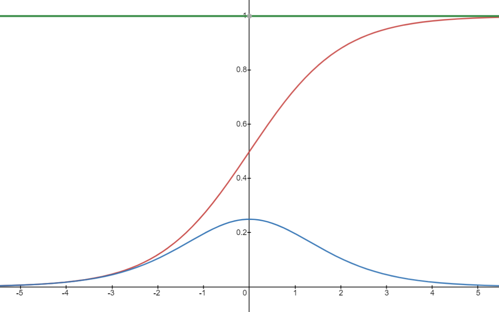
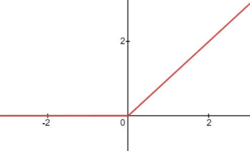
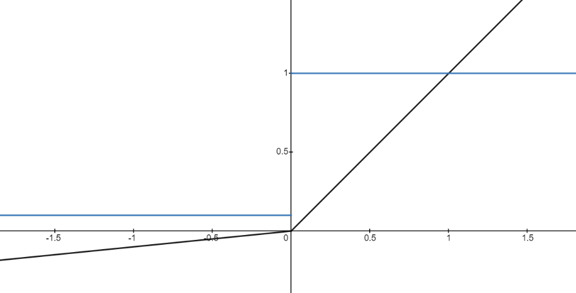
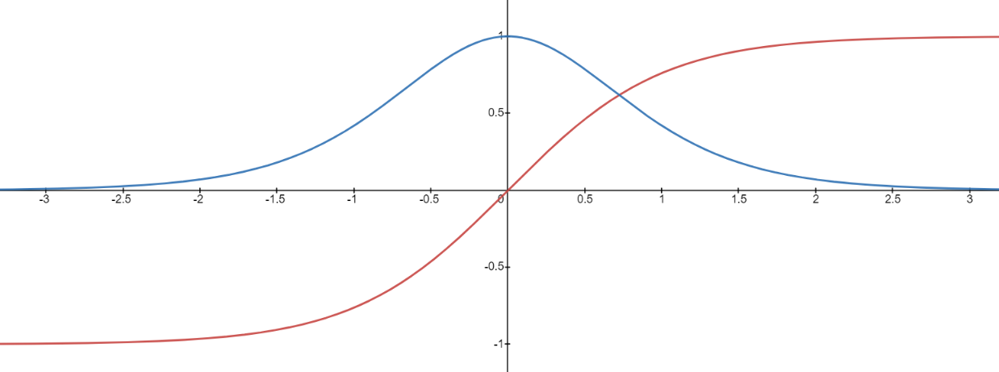
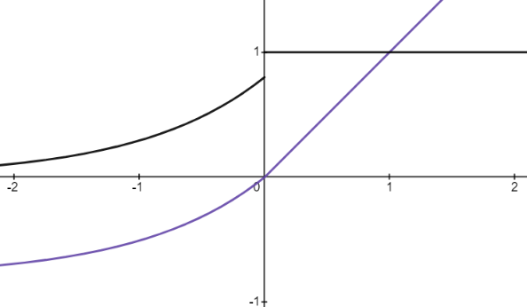

激活函数本质是向神经网络中**引入非线性因素**，通过激活函数，神经网络可以**拟合各种曲线**。如果不用激活函数，每一层输出都会是上一层输入的线性函数，引入非线性函数作为激活函数，输出将可以**逼近任意函数**。

### Sigmoid

**公式**：$f(x)=\frac{1}{1+e^{-x}}$ 

**梯度**：$f'(x)=\frac{e^{-x}}{(1+e^{-x})^2}=\frac{1}{1+e^{-x}}-(\frac{1}{1+e^{-x}})^2=f(x)-f^2(x)$

**图像以及梯度图像**：

Sigmoid函数的输出**值域在0到1之间**，具有连续可导、单调递增的性质。但是，当输入值较大或较小的时候，Sigmoid函数的梯度会趋近于0，导致**梯度消失**的问题，从而影响模型的训练效果。而且，Sigmoid函数的输出恒为正值，不是以零为中心的，这会导致权值更新时只能朝一个方向更新，从而**影响收敛速度**。

一般Sigmoid函数只用于**二分类的输出层**。

### ReLU

**公式**：$f(x) = max(0, x)$ 

**梯度**：$f'(x)=\begin{cases}0,&x<0\\1,&x>0 \end{cases}$

**函数图像**：

ReLU是一种常用的激活函数，ReLU提出就是为了解决梯度消失问题。它将输入值在**负数区域输出0**，在**正数区域输出该数值**本身。

ReLU函数具有以下几个优点：

1. 加速收敛：ReLU函数的导数在输入大于0时恒等于1，使得网络的**反向传播更加稳定**，可以加速模型的训练。
2. 稀疏性：ReLU函数的输出值在负数区域恒等于0，可以使得网络的隐藏层的神经元出现稀疏性，进一步**减少计算量和存储空间**。
3. 解决梯度消失问题：在较深的网络结构中，使用Sigmoid或tanh等激活函数容易导致梯度消失的问题，而ReLU可以有效地避免这个问题。

ReLU函数在深度学习中得到广泛应用，但是它也存在一些问题，例如输出为0的区域梯度为0，这会导致**梯度更新停止**，进而导致**神经元“死亡”**的问题。因此，一些变种的ReLU函数被提出，例如Leaky ReLU和ELU等。

### LeakyReLU

**公式**：$f(x)=\begin{cases} x, & x>0 \\ \alpha x, & x\leq 0 \end{cases}$ 

**梯度**：$f'(x)=\begin{cases} 1, & x>0 \\ \alpha , & x\leq 0 \end{cases}$

**图像如下**：

LeakyReLU的提出就是为了解决神经元”死亡“问题，LeakyReLU与ReLU很相似，仅在输入小于0的部分有差别，ReLU输入小于0的部分值都为0，而LeakyReLU输入小于0的部分，值为负，且有微小的梯度，从而增加模型的**稳定性**。实际中，LeakyReLU的α取值一般为**0.01**。

超参数α的取值也已经被很多实验研究过，有一种取值方法是 对α随机取值，α的分布满足均值为0,标准差为1的正态分布，该方法叫做**随机LeakyReLU**(Randomized LeakyReLU)。原论文指出随机LeakyReLU相比LeakyReLU能得更好的结果，且给出了参数α的经验值**1/5.5**(好于0.01)。至于为什么随机LeakyReLU能取得更好的结果，解释之一就是随机LeakyReLU小于0部分的随机梯度，为优化方法引入了随机性，这些随机噪声可以帮助参数取值跳出局部最优和鞍点。正是由于α的取值至关重要，人们不满足与随机取样α，有论文将α作为了需要学习的参数，该激活函数为**PReLU**(Parametrized ReLU)。

### Tanh

**公式**：$f(x)=\frac{e^x-e^{-x}}{e^x+e^{-x}}$ 

**梯度**：

**图像**：

Tanh函数的优点在于它的**输出值在\[-1, 1]**之间，比Sigmoid函数的输出范围更广，因此可以更好地避免梯度消失问题，当输入的值趋于正无穷或负无穷时，tanh的梯度同样会趋近零，造成**梯度消失**。与Sigmoid函数相似，Tanh函数也具有Sigmoid函数的非线性特性，能够帮助模型学习**非线性关系**。同时，Tanh函数也具有零均值，这使得其收敛速度比Sigmoid快，也可以对数据进行中心化。

在深度学习中，Tanh函数通常作为激活函数使用在**隐藏层**中，而不是输出层中，因为输出层通常需要正值或者是概率。

^tanh

### Softmax

**公式**：$f(x_i)=\frac{e^{x_i/\tau}}{\sum_{j}e^{x_j/\tau}}$

**梯度**：$\frac{\partial f(x_i)}{\partial x_i}
=\frac{e^{x_i}\sum_{j}e^{x_j}-e^{x_i}e^{x_i}}{(\sum_{j}e^{x_j})^2}
=\frac{e^{x_i}}{\sum_{j}e^{x_j}}(1-\frac{e^{x_i}}{\sum_{j}e^{x_j}})
=f(x_i)(1-f(x_i))$

Softmax常用于**多分类**问题中，他是二分类函数Sigmoid在多分类上的推广，目的是将多分类的结果**以概率的形式**展现出来，同时，可以将为负值的输出转化为正的概率值。它将一个K维的向量（K为类别数量）映射到一个概率分布上，使得每个元素的取值在0和1之间，而且它们的**和等于1**。

$\tau$是温度参数，可以调整分布的平滑程度。

Softmax函数的输出具有归一化性质，即各个类别的概率和为1。因此，在进行多分类问题时，输入数据需要进行one-hot编码，而在计算损失时，使用交叉熵损失函数。

^softmax

### ELU(Exponential Linear Unit)

**公式**：$f(x)=\begin{cases}x,&x>0\\\alpha(e^x-1),&x<0\end{cases}$

**梯度**：$f'(x)=\begin{cases}1,&x>0\\\alpha e^x,&x<0\end{cases}$

**图像**：

输入大于0部分的梯度为1,输入小于0的部分无限趋近于-α，超参数取值一般为1.
ELU相比于ReLU和LeakyReLU的优点在于：

1. 对于负数的输出，ELU可以使梯度**不会变得太小**，因为当x小于0 时，导数会趋近于0而不是被截断为一个常数值。
2. 当x的值较大时，ELU仍然可以保持一个较大的导数，从而**加速学习过程**。

但是，ELU的缺点在于，**计算复杂度**比ReLU和LeakyReLU高，因为它涉及到指数运算。
总的来说，如果网络需要处理的数据集有很多负数，或者你需要防止梯度消失或爆炸，那么可以尝试使用ELU。

### 选择方式

**隐藏层：**
1. 优先选择ReLu函数，如果效果不好，尝试其他，比如LeakyReLu；
2. 不要使用Sigmoid函数，可以尝试Tanh函数。

**输出层：**
1. 二分类问题选择Sigmoid函数；
2. 多分类问题选择Softmax函数；
3. 回归问题选择Identity函数。$（f(x)=x）$
