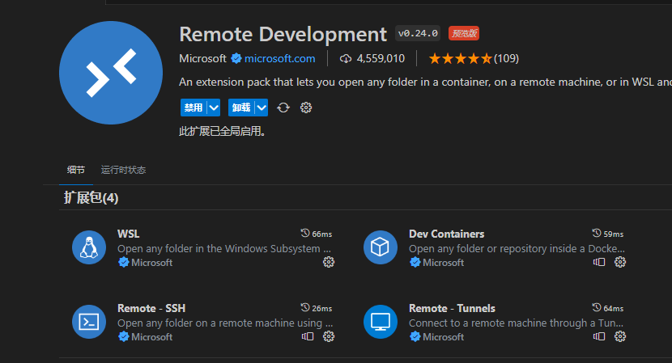
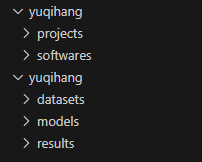

> 进入实验室，分配到服务器用户名和密码，记录一下配置过程


### 服务器信息

在用户文件夹下的 .ssh 文件夹下的config文件中，保存服务器信息

    Host alias
    HostName hostname
    User user
    Port port

系统：Linux
硬盘空间：系统盘，数据盘

- /home 下的用户名文件夹是系统盘下个人空间
- /data 下的用户名文件夹是数据盘下个人空间


### 服务器连接

喜欢使用VSCode连接，可以一边看文件，一边在终端执行操作

1. 只需要在VSCode插件市场搜索Remote Development进行安装，就会安装一系列连接服务器需要的插件
2. 左边会出现**远程资源管理器**栏目，左下角会出现**打开远程窗口**按钮
3. 点击按钮即可按照要求进行连接。如果按照上一节保存了信息，只需要选择对应的服务器，输入密码即可。
4. 初次连接资源管理器是空的，可以打开自己的文件夹，要添加更多文件夹，可以右键资源管理器的空白处添加文件夹到工作区。 

### 服务器配置


#### 结构安排

为了不影响使用的速度，存储性的功能放在数据盘，只在系统盘保留软件安装和正在使用的项目代码，架构图如下：系统盘存放项目和软件，数据盘存放数据集，模型以及实验结果

 

#### conda安装

首先下载安装包到服务器，进入到想下载的地方之后，可以使用wget命令，这里进入到softwares文件夹

```bash
# 浙大源，内网超级快
wget https://mirror.zju.edu.cn/anaconda/archive/Anaconda3-2023.09-0-Linux-x86_64.sh
# 官网，超级慢
wget https://repo.anaconda.com/archive/Anaconda3-2023.09-0-Linux-x86_64.sh
```

运行安装包，名字好长，可以通配符

```bash
bash Ana*.sh
```

回车开始阅读协议，空格下翻，输入`yes`同意协议
可以输入自定义安装目录，为了便于管理，这里选择安装在`/softwares/anaconda3`文件夹下
安装完成之后开始配置，根据需求自行选择，回到**用户目录**执行下面命令，初始化命令行

```bash
source ~/.bashrc
```

安装完成，检查是否成功，显示版本信息，就是成功了

```bash
conda --version
```

然后进行换源以实现加速

```bash
# 开始没有配置文件，执行下面命令生成，会位于用户根目录下
conda config --set show_channel_urls yes
# 此时已经生成 .condarc，我们打开它
code .condarc
# 修改内容为以下内容
channels:
  - defaults
show_channel_urls: true
default_channels:
  - https://mirrors.zju.edu.cn/anaconda/pkgs/main
  - https://mirrors.zju.edu.cn/anaconda/pkgs/r
  - https://mirrors.zju.edu.cn/anaconda/pkgs/msys2
custom_channels:
  conda-forge: https://mirrors.zju.edu.cn/anaconda/cloud
  msys2: https://mirrors.zju.edu.cn/anaconda/cloud
  bioconda: https://mirrors.zju.edu.cn/anaconda/cloud
  menpo: https://mirrors.zju.edu.cn/anaconda/cloud
  pytorch: https://mirrors.zju.edu.cn/anaconda/cloud
  pytorch-lts: https://mirrors.zju.edu.cn/anaconda/cloud
  simpleitk: https://mirrors.zju.edu.cn/anaconda/cloud
```

为了避免环境占用过多系统盘资源，将环境移动到数据盘

```bash
# 查看conda信息，envs directories表示当前环境存储位置
conda info
# 在.condarc末尾增加以下内容
envs_dirs:
  - /data/yuqihang/envs/envs
pkgs_dirs:
  - /data/yuqihang/envs/pkgs
```

其余配置参考[Anaconda下载安装与使用](../../Softwares/Environment/Anaconda下载安装与使用.md)]


#### git配置

git已经预安装，只需要配置一下连接到自己的远程仓库即可

```bash
git config --global user.name "Yu-Qi-hang"
git config --global user.email "2659464450@qq.com"
ssh-keygen -t rsa -C "2659464450@qq.com"
```

执行之后一直回车即可，此时已经生成了公钥文件在`~/.ssh/id_rsa.pub`，参考[Git安装以及Github连接本地](..\Windows相关\Git安装以及Github连接本地.md)连接并验证 

### 命令速查

查看服务器的系统：uname -a

查看显卡当前状态：nvidia-smi

持续监控显卡状态：watch nvidia-smi

程序执行指定CPU：taskset -c 1 python main.py

程序执行指定GPU：

下载某个链接的文件：wget --user 《可能需要的用户名》 --password 《可能需要的密码》 《链接》

后台运行指令：nohup 《原指令》> 《输出信息的文件》 2>&1 &
