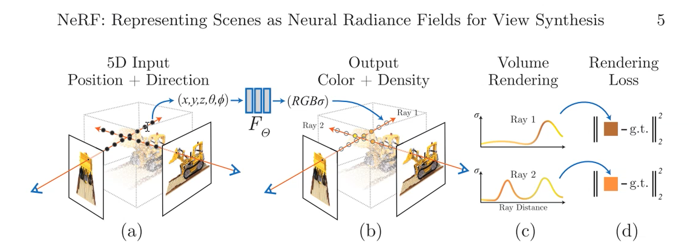
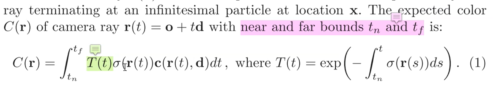
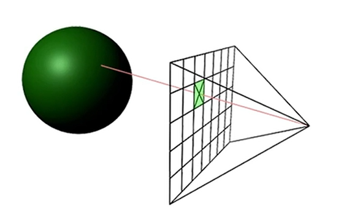

> [NeRF: Representing Scenes as Neural Radiance Fields for View Synthesis](https://arxiv.org/abs/2003.08934)
> 
> 2023.09.11
> 
> 神经辐射场表示场景来做新视角合成

体渲染中的光学模型：$T(t)$是一个衰减函数，从光线遇到物体表面开始迅速衰减，避免透视的出现。
$r(t)=o+td$，o是观测点位置坐标
光线的视角方向 $d=(\theta,\phi)$

