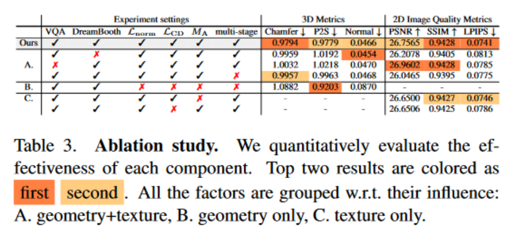

# 结合 Stable Diffusion 的人体编辑以及驱动

## Text-guided Reconstruction of Lifelike Clothed Humans

### background

从单个图像中重建穿着衣物的人物时，准确还原“看不见的区域”并保留高级细节仍然是一个未解决的具有较少关注的挑战。现有方法通常会生成过于平滑的背面表面和模糊的纹理。

从单一图像重建衣着的人类方面取得了进展，但准确地恢复具有高级细节的"看不见的区域"仍然是一个尚未解决的挑战，缺乏关注。
现有的方法往往生成纹理模糊的过度平滑的背面表面。
但是如何有效地从单张图像中捕获个体的所有视觉属性，这些视觉属性足以重建出看不见的区域(例如,后视图) 

### motivation

给定一幅图像，TeCH重建出一个逼真的3D衣服人体，"Lifelike"是指：

1. 在额区和看不见的区域都有详细的全身几何图形，包括面部特征和服装皱纹；
2. 颜色一致、图案错综复杂的高质量纹理。

关键的insight是：

1. 通过garment parsing model和Visual Questioning Answering（VQA）自动生成的描述性文本提示（例如服装，颜色，发型）来重建3D人;
2. 个性化的微调Text-to-Image (T2I) diffusion model，赋能该模型学习“难以形容”的外观。

为了以可承受的成本表示高分辨率的3D穿衣服的人，我们提出了一种基于DMTet的混合3D表示，它由明确的身体形状网格和一个隐式距离场组成。
在描述性提示+个性化T2I扩散模型的指导下，通过multi-view Score Distillation Sampling（SDS）和基于原始观测的重建损失来优化3D人的几何形状和纹理。
TeCH生产高保真3D服装人，具有一致和细腻的纹理，以及详细的全身几何形状。
定量和定性实验表明，TeCH在重建精度和渲染质量方面优于最先进的方法。

### Method

人体解析模型SegFormer和视觉问答模型BLIP用于生成图像中的人物的描述信息 $P_{VQA}$。
DreamBooth 是一种通过少量镜头调整（3∼5 张图像）来“个性化”扩散模型的方法。
描述信息 $P_{VQA}$ 用于指导DreamBooth的生成过程，获得涵盖独特外观的标识符token $[V]$。
将 $[V]$ 结合 $P_{VQA}$ 获得最终的提示 $P$，用于指导个性化的DreamBooth $D'$。

初始化人体$M_{body}$,通过网格膨胀和上下采样创建$M_{shell}$。
多层感知机$\Psi_{g},\Psi_{c}$学习几何和颜色的知识。
多阶段、从粗到细的优化过程，按顺序恢复主体的几何形状和纹理。
利用四面体表示来模拟主体的几何形状，使用从四面体网格中提取的网格恢复外观
这两个阶段都使用个性化的DreamBooth模型利用基于SDS的损失，该模型通过对新的摄像机视图进行采样来提供多视图监督。

### Experiment

TeCH在3D指标和2D图像质量指标方面都超过了SOTA基线。这证明了其在精确重建具有复杂细节的服装人体几何形状以及产生具有一致外观的高质量纹理方面的卓越性能。
使用倒角（Chamfer，双向点到面）和 P2S（1 向点到面）距离定量评估几何体和外观的重建质量，以测量重建网格和真实网格之间的差异。从两个网格渲染的L2 Normal误差，以通过将相机旋转{0◦，90◦，180◦，270◦} w.r.t.到输入视图来测量局部表面细节的一致性和精细度。
为了评估纹理的质量，我们在以与正常图像相同的方式渲染的多视图彩色图像上报告了2D图像质量指标，包括PSNR（峰值信噪比），SSIM（结构相似性）和LPIPS（学习的感知图像路径相似性）。
TeCH 在 CAPE 上的所有 2D 指标和 3D 指标上都表现出卓越的性能。这表明TeCH可以准确地重建几何形状和纹理，即使是具有挑战性的姿势（CAPE）或宽松的衣服（THuman2.0）。然而，在THuman2.0上，它实现了与基于先前的方法相当的重建精度。这可以归因于这样一个事实，即幻觉的背面可能与真相不同，但仍然看起来很真实。

报告了与其他基线相比，用户对TeCH的偏好百分比。大多数参与者在几何和彩色渲染（纹理）方面都更喜欢TeCH。

为了评估TeCH在野外图像上的泛化并评估结果的感知质量，我们使用来自SHHQ数据集的90张随机采样图像进行了一项感知研究。向参与者展示了由TeCH重建的旋转3D人类的视频，以及基线（PaMIR \[136]，PIFu \[103]，ICON\[120]，ECON \[121]和PHORHUM \[5]）。他们被要求根据输入图像选择更真实和一致的结果。我们从63名参与者那里收集了总共3，150个成对比较，均匀地涵盖了90个SHHQ受试者。选项卡 2 中的结果表明，在几何形状和纹理方面，TeCH 都是首选。如图8所示，与其他倾向于重建过于光滑的表面和模糊纹理的方法不同，TeCH在应用于具有不同服装风格和手势的野外图像时表现出显着的泛化性。它可以产生更逼真的服装、发型和面部细节，即使是看不见的背面视图。

VQA 提示有助于恢复服装的整体结构，而 DreamBooth 增强了纹理图案的精细细节 

## Editing Conditional Radiance Fields

神经辐射场 （NeRF） 是支持高质量视图合成的场景模型，并针对每个场景进行优化。在本文中，我们探讨了允许用户编辑在形状类别上训练的类别级 NeRF（也称为条件辐射场）。
具体来说，我们介绍了一种将粗略的2D用户涂鸦传播到3D空间的方法，以修改局部区域的颜色或形状。

首先，我们提出了一个条件辐射场，其中包含新的模块化网络组件，包括跨对象实例共享的形状分支。通过观察同一类别的多个实例，我们的模型在没有任何监督的情况下学习底层部分语义，从而允许将粗略的2D用户涂鸦传播到整个3D区域（例如，椅子座位）。
接下来，我们提出了一种针对特定网络组件的混合网络更新策略，以平衡效率和准确性。在用户交互过程中，我们制定了一个既满足用户约束又保留原始对象结构的优化问题。我们在三个形状数据集的渲染视图上演示了我们的编辑方法，并表明它优于以前的神经编辑方法。
最后，我们编辑单视图真实照片的外观和形状，并显示编辑传播到外推的新视图。 

### background

3D内容创建通常涉及为视觉效果或增强现实应用程序操作高质量的3D资产，3D艺术家工作流程的一部分包括对3D场景的外观和形状进行局部调整。
显式表示使艺术家能够控制 3D 场景的不同元素。例如，艺术家可以使用网格处理工具对场景几何形状进行局部调整，或通过操纵纹理图集来更改表面外观。在艺术家的工作流程中，这种明确的表示通常是手工创建或程序生成的。
虽然显式表示功能强大，但由于依赖于视图的外观、复杂的场景拓扑和不同的表面不透明度，在自动获取真实场景的高质量显式表示方面仍然存在重大技术挑战。
最近，隐式连续体积表示显示了各种3D场景的高保真捕获和渲染，并克服了上述许多技术挑战。这种表示以神经网络的权重对捕获的场景进行编码。神经网络学习从点样本沿投射光线渲染与视图相关的颜色，并通过 alpha 合成获得最终渲染 。这种表示支持许多逼真的视图合成应用。
然而，我们缺乏关于如何使艺术家在这种表现形式中进行控制和编辑的关键知识。

### motivation

编辑隐式连续体积表示具有挑战性。首先，我们如何有效地传播稀疏的 2D 用户编辑以填充此表示中的整个相应 3D 区域？其次，隐式表示的神经网络有数百万个参数。目前尚不清楚哪些参数控制渲染形状的不同方面，以及如何根据稀疏的本地用户输入更改参数。虽然3D编辑的先前工作主要集中在编辑显式表示，但它们不适用于神经表示。

在本文中，我们研究了如何使用户能够编辑和控制3D对象的隐式连续体积表示。如图 1 所示，我们考虑了三种类型的用户编辑：
1. 将局部部件的外观更改为新的目标颜色（例如，将椅子座椅的颜色从米色更改为红色），
2. 修改局部形状（例如，移除椅子的轮子或从不同的椅子换入新手臂），
3. 从目标对象实例转移颜色或形状。用户通过在编辑应进行的位置的所需位置上涂鸦并选择目标颜色或局部形状来执行 2D 本地编辑。

### method

我们通过研究如何有效地更新条件辐射场以与目标本地用户编辑保持一致来解决编辑隐式连续表示的挑战。我们做出以下贡献。
首先，我们学习整个对象类上的条件辐射场，以模拟看似合理的对象的丰富先验。出乎意料的是，此先验通常允许传播稀疏的用户涂鸦编辑以填充所选区域。我们演示了复杂的编辑，而无需施加明确的空间或边界约束。此外，当从不同视点渲染对象时，编辑显示一致。
其次，为了更准确地重建形状实例，我们在条件辐射字段中引入了一个在对象实例之间共享的形状分支，这隐式地偏向网络以尽可能编码共享表示。
第三，我们研究了条件辐射场网络的哪些部分影响不同的编辑任务。我们表明，形状和颜色编辑可以有效地在网络的后期层中进行。这一发现促使我们只更新这些图层，并使我们能够以显着的计算速度生成有效的用户编辑。
最后，我们引入了颜色和形状编辑损失，以满足用户指定的目标，同时保留原始对象结构。
我们提出的解决方案，如图2 ( c )所示，通过更新网络的特定层来实现精度和效率。为了减少计算量，我们只对网络的后几层进行微调。这些选择只计算后面层的梯度，而不是整个网络的梯度，从而加快了优化的速度。在编辑颜色时，只更新网络中的Frad和z ( c )，比优化整个网络(从972秒到260秒)减少了3.7 ×的优化时间。在编辑形状时，只更新Ffuse和Fdens，优化时间减少了3.2 × ( 1 081 ~ 342 s)。在4.3节中，我们进一步量化了编辑精度和效率之间的权衡。为了进一步减少计算量，我们在编辑过程中增加了两个步骤。

### experiment

我们评估了我们的模型和几个关于视图重建的消融。注意形状和颜色编码的分离以及共享/实例网络的使用是如何提高视图合成质量的。我们的模型甚至优于单实例NeRF模型(每个人在一个对象上进行训练)。

我们评估源对象实例的颜色编辑，以匹配目标实例。值得注意的是，我们的方法在所有标准上都优于基线。

我们将颜色编辑结果可视化，目标是将源实例的颜色与目标匹配。我们的方法在一个视图上进行涂鸦的情况下，准确地捕获了目标实例的颜色。注意到( c )编辑单实例NeRF会导致视觉伪影，( d )重写GAN无法将编辑传播到看不见的视图并产生不切实际的输出。

注意到我们的混合网络更新方法如何在平衡计算成本的同时实现高视觉编辑质量。

我们的方法成功地移除了手臂并填充了椅子的孔洞。注意，仅仅优化形状代码或分支是无法同时适应这两种编辑的。优化整个网络是缓慢的，并且会导致实例中不必要的变化。

我们在三个形状数据集的渲染视图上演示了结果，这些数据集具有不同级别的外观、形状和训练视图复杂性。与以前的神经编辑方法相比，我们展示了我们的方法在对象视图合成以及颜色和形状编辑方面的有效性。此外，我们展示了我们可以编辑真实单视图照片的外观和形状，并且编辑传播到外推的新视图。我们强烈建议观看我们的视频，看看我们的编辑演示。代码和更多结果可在我们的 GitHub 存储库和网站上找到。

我们介绍了一种从3D物体集合中学习条件辐射场的方法。此外，我们还展示了如何使用我们学习到的解耦表示来执行直观的编辑操作。我们方法的一个局限性是形状编辑的交互性。目前，用户需要花费超过一分钟的时间来获得形状编辑的反馈。编辑操作计算的大部分花费在绘制视图上，而不是编辑本身。我们乐观地认为，NeRF渲染时间的改进将有助于\[ 46、75 ]。另一个限制是我们的方法未能重建出与其他类实例有很大差异的新对象实例。尽管存在这些局限性，我们的方法为探索其他高级编辑操作开辟了新的途径，例如r
