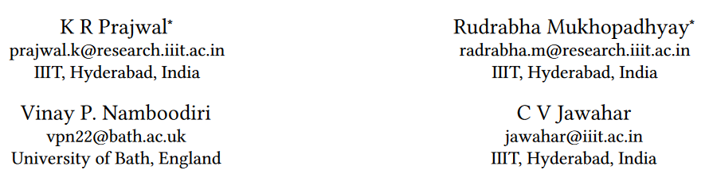
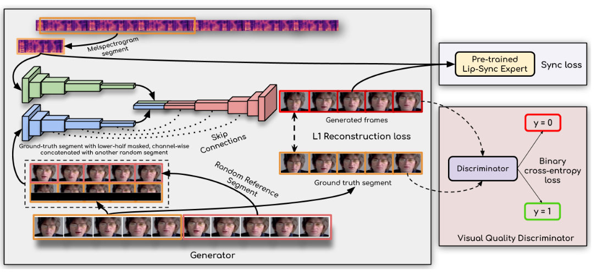

主要目标：以假乱真的语音驱动2D真人视频讲话
业界产品： 硅基，剪映，如影 

## 论文梳理

## A Lip Sync Expert Is All You Need for Speech to Lip Generation In The Wild

| [code](https://github.com/Rudrabha/Wav2Lip) | [paper](https://arxiv.org/abs/2008.10010) |


```citation
K R Prajwal, Rudrabha Mukhopadhyay, Vinay P. Namboodiri, and C.V. Jawahar. 2020. A Lip Sync Expert Is All You Need for Speech to Lip Generation In the Wild. In Proceedings of the 28th ACM International Conference on Multimedia (MM '20). Association for Computing Machinery, New York, NY, USA, 484–492. https://doi.org/10.1145/3394171.3413532
```


这项工作研究的问题是合成一个任意身份说话的脸的嘴唇动作视频，以匹配一个目标语音段。目前的工作擅长在训练过程中看到的**特定人的静态图像或视频**上产生准确的嘴唇动作。然而，它们无法在**动态、无约束的人脸视频**中准确地变形**任意身份**的嘴唇运动，**导致视频**中的重要部分与**新音频不同步**。

- 我们确定了与此相关的关键原因，并通过学习一个强大的**唇合成判别器**来解决这些问题。
- 接下来，我们提出了新的、严格的**评估基准和度量标准**，以准确地衡量非约束视频中的唇动同步性。

现实世界中的视频包含**快速的姿态、尺度和光照变化**，生成的人脸结果也必须无缝地融合到原始目标视频中。



## VideoReTalking: Audio-based Lip Synchronization for Talking Head Video Editing In the Wild

| [code](https://github.com/OpenTalker/video-retalking) | [paper](https://arxiv.org/abs/2211.14758) | 

### StyleSync: High-Fidelity Generalized and Personalized Lip Sync in Style-based Generator

| [code](https://github.com/guanjz20/StyleSync) | [project](https://hangz-nju-cuhk.github.io/projects/StyleSync) | 

### SelfTalk: A Self-Supervised Commutative Training Diagram to Comprehend 3D Talking Faces

| [code](https://github.com/psyai-net/SelfTalk_release) | [paper](https://arxiv.org/abs/2306.10799) |