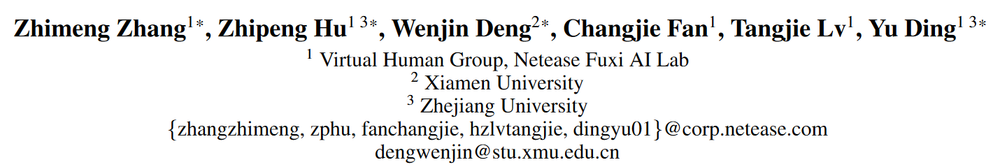
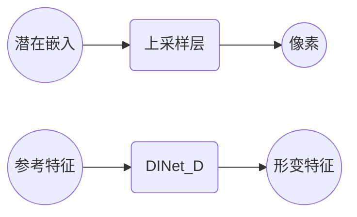
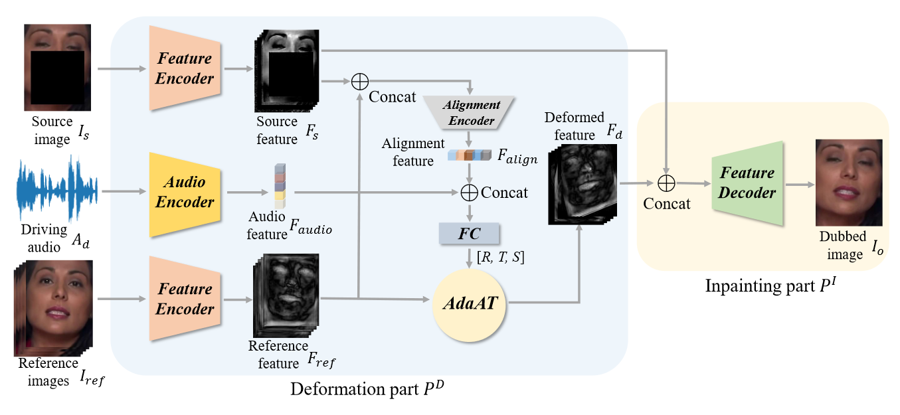
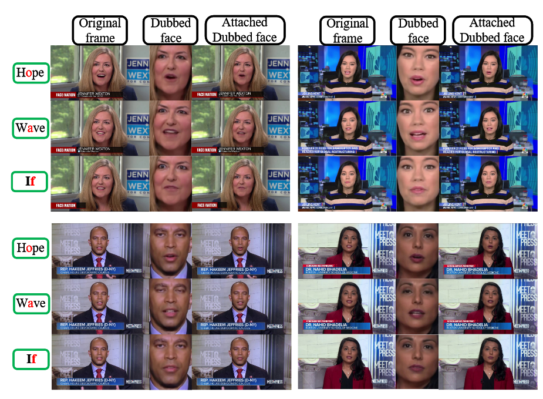
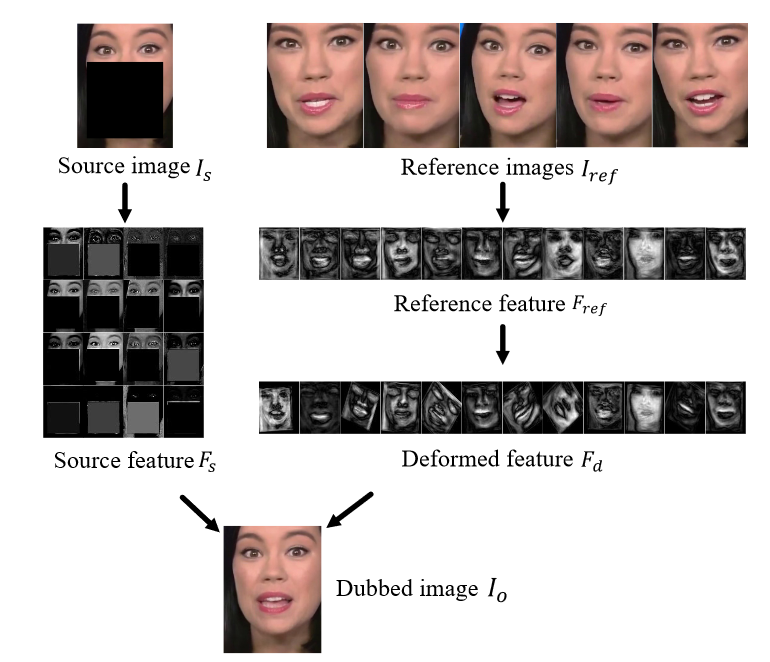
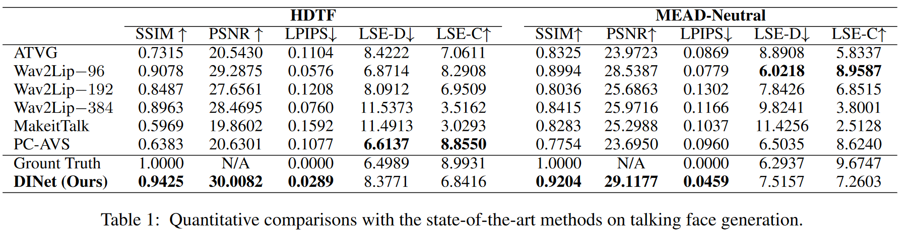
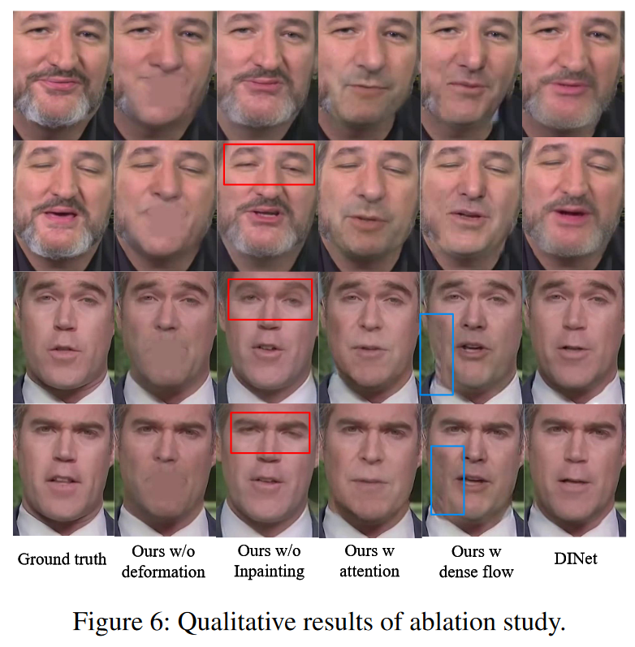
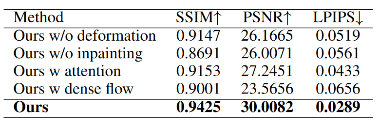

## DINet

| [code](https://github.com/MRzzm/DINet) | [paper](https://arxiv.org/abs/2303.03988) |



```citation
Zhimeng Zhang, Zhipeng Hu, Wenjin Deng, Changjie Fan, Tangjie Lv, and Yu Ding. 2023. DINet: deformation inpainting network for realistic face visually dubbing on high resolution video. In Proceedings of the Thirty-Seventh AAAI Conference on Artificial Intelligence and Thirty-Fifth Conference on Innovative Applications of Artificial Intelligence and Thirteenth Symposium on Educational Advances in Artificial Intelligence (AAAI'23/IAAI'23/EAAI'23), Vol. 37. AAAI Press, Article 395, 3543–3551. https://doi.org/10.1609/aaai.v37i3.25464
```

### Background and Motivation
对于**少镜头学习**来说，在**高分辨率视频**上实现逼真的人脸视觉配音仍然是一个严峻的挑战。以往的作品未能产生高保真的配音效果。为了解决上述问题，本文提出了一种用于高分辨率人脸视觉配音的变形修复网络（DINet）。

与之前依赖多个**上采样层**直接从**潜在嵌入**生成**像素**的工作不同，DINet 对参考图像的**特征图**进行**空间变形**，以更好地保留**高频纹理细节**。



### contribution and novelty

DINet由 deformation 和 inpainting 组成。

在第一部分中，首先分别对源面部和驱动音频中的头部姿势和语音内容特征进行编码，然后利用这些特征对参考面部进行变形，五个参考面部图像自适应地执行空间变形，以创建逐帧编码嘴部形状的变形特征图，以便与输入驱动音频以及输入源图像的头部姿势对齐。

在第二部分中，为了产生面部视觉配音，特征解码器通过卷积层融合源面部特征和变形结果来修复源嘴部区域的像素，自适应地将来自变形特征图的嘴部运动和来自源特征图的其他属性（即头部姿势和上面部表情）合并在一起。

空间变形能够将嘴型与驱动音频同步，并将头部姿势与源面部对齐。变形操作将像素移动到适当的位置，而不是从头开始生成，因此它几乎保留了所有纹理细节。



#### Deformation Part 
给定一个源图像 $I_{S}\in R^{3\times H\times W}$，一个驱动音频 $A_{d}\in R^{T\times 29}$（29 是音频特征的维度，使用deepspeech feature）和五个参考图像 $I_{ref}\in R^{15\times H\times W}$ 。

将 $A_{d}$ 输入到一个音频编码器中以提取音频特征 $F_{audio}\in R^{128}$。 将 $I_{S}$ 和 $I_{ref}$ 输入到**两个不同**的特征编码器中，提取源特征 $F_{S}\in R^{256\times \frac{H}{4}\times\frac{W}{4}}$ 和参考特征 $F_{ref}\in R^{256\times \frac{H}{4}\times\frac{W}{4}}$。

连接 $F_{S}$ 和 $F_{ref}$ 并输入到一个对齐编码器中，以计算对齐特征 $F_{align}\in R^{128}$。$F_{align}$ 对 $I_{S}$ 和 $I_{ref}$ 之间的**头部姿势**的对齐信息进行编码。最后，使用  $F_{audio}$ 和  $F_{align}$ 将 $F_{ref}$ 在空间上变形为 $F_{d}$。

借助了 $AdaAT$ 实现空间变形，AdaAT 可以通过进行特征通道特定的变形来使空间布局未对齐的特征图变形。 AdaAT算子在不同的特征通道中计算不同的仿射系数。$P^{D}$ 中全连接层用于计算旋转系数 $R=\{\theta^{c}\}^{256}_{c=1}$，平移 $T_{x}=\{t^{c}_{x}\}^{256}_{c=1}/T_{y}=\{t^{c}_{y}\}^{256}_{c=1}$ 和尺度 $S=\{s^{c}\}^{256}_{c=1}$。这些仿射系数用于 $F_{ref}$ 的仿射变换：
$$\begin{bmatrix}
\hat{x}_{c}\\
\hat{y}_{c} 
\end{bmatrix}
=
\begin{bmatrix}
s^{c}\cos(\theta^{c})&s^{c}(-\sin(\theta^{c}))&t_{x}^{c}\\
s^{c}\sin(\theta^{c})&s^{c}\cos(\theta^{c})&t_{y}^{c}
\end{bmatrix}
\begin{bmatrix}
x_{c}\\y_{c}\\1
\end{bmatrix}
$$

#### Inpainting Part
$P^{I}$ 的目标是从 $F_{S}$ 和 $F_{d}$ 生成配音图像 $I_{o}\in R^{3\times H\times W}$。$F_{S}$ 和 $F_{d}$ 在特征通道中连接起来，使用一个具有卷积层的特征解码器来修复被遮蔽的嘴巴并生成 $I_{o}$。

#### Loss Function

**Perception Loss**
计算两个图像尺度的感知损失，将配音图像 $I_{o}$ 和真实图像 $I_{r}$ [下采样](../../../Concept/AI/采样.md#下采样（Downsampling）) 为 $\hat{I}_{o}\in R^{3\times \frac{H}{2}\times \frac{W}{2}}$ 和 $\hat{I}_{r}\in R^{3\times \frac{H}{2}\times \frac{W}{2}}$。然后，配对图像 $\{I_{o}, I_{r}\}$ 和 $\{\hat{I}_{o}, \hat{I}_{r}\}$ 输入到一个预训练的 $VGG\text{-}19$ 网络中以计算感知损失：
$$
\mathcal{L}_{p}=\sum_{i=1}^{N}\frac{\parallel V_{i}(I_{o})-V_{i}(I_{r})\parallel_{1}+\parallel V_{i}(\hat{I}_{o})-V_{i}(\hat{I}_{r})\parallel_{1}}{2NW_{i}H_{i}C_{i}}
$$
$V_{i}(\cdot)$ 表示 $VGG\text{-}19$ 第 $i$ 层的特征，而分母是对应的特征尺寸。

**GAN Loss**
使用 $LS\text{-}GAN$ 损失：
$$
\mathcal{L}_{D}=\frac{1}{2}E(D(I_{r})-1)^{2}+\frac{1}{2}E(D(I_{o})-0)^{2}
$$
$$
\mathcal{L}_{G}=E(D(I_{o})-1)^{2}
$$
$G$ 代表 DINet，$D$ 代表判别器。我们在单帧和五个连续帧上使用 GAN 损失。 

**Lip-sync loss**
使用 $sycnet$ 作为同步衡量方法，使用 $deepspeech$ 特征替换原来的频谱训练得到。同步损失如下：
$$
\mathcal{L}_{sync}=E(sycnet(A_{d},I_{o})-1)^{2}
$$

最后损失：
$$
\mathcal{L}=\lambda_{p}\mathcal{L}_{p}+\lambda_{sycnet}\mathcal{L}_{sycnet}+\mathcal{L}_{D}+\mathcal{L}_{G}
$$

### Experiment











### Thinking

本文使用的是形变的方式来调整图像特征值，相较于重建像素的方法保留了更多的细节信息，很有利于生成高清晰度的结果。

使用修复源图像的方法而不是从特征直接重建，这个过程中引入有效的上面部的特征指导，避免上面部动作不合理。

DINet 变形参考图像以修复源面部的嘴部区域，因此它无法处理多变的光照、动态背景、下垂的耳环、飘逸的头发和相机运动的条件。如果嘴部区域包含背景，则可能会产生面部伪影。因此，合成面部图像对参考图像的选择很敏感。