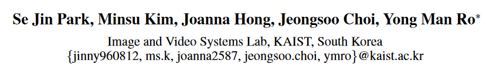

## title

| code | [paper](https://ojs.aaai.org/index.php/AAAI/article/view/20102) |



```citation
Park, S.J., Kim, M., Hong, J., Choi, J. and Ro, Y.M. 2022. SyncTalkFace: Talking Face Generation with Precise Lip-Syncing via Audio-Lip Memory. _Proceedings of the AAAI Conference on Artificial Intelligence_. 36, 2 (Jun. 2022), 2062-2070. DOI:https://doi.org/10.1609/aaai.v36i2.20102.
```

### Background and Motivation

从语音生成说话脸部的挑战在于**对齐音频和视频**，使得嘴部区域动作与输入的音频对应。

以前的方法要么利用视听表示学习，要么利用中间结构信息，例如 landmarks 和 3D 模型。然而，他们很难合成**音素级别**上变化的嘴唇的**精细细节**，因为它们在视频合成步骤中不能充分提供**嘴唇的视觉信息**。

### contribution and novelty


1. 提出 Audio-Lip Memory ，它将来自连续 ground truth image 的**嘴唇运动特征**存储在值存储器中，并将它们与相应的音频特征对齐，使用检索到的嘴唇运动特征作为视觉提示，可以在合成步骤中轻松地将音频与视觉动态相关联。
2. 引入了 **visual-visual 同步损失**，模型中的视听同步损失一起使用时，可以增强口型同步性能。
3. 通过分析内存中学习到的表示，确认音频唇形存储器存储音素级别的**代表性唇形特征**在每个内存槽中，并且寻址槽的不同组合会产生唇形特征的**各种组合**，从而实现复杂且多样化的唇形运动。因此，使用内存地址直接操纵嘴唇运动是可能的。


#### 流程说明
通过 Audio Encoder 可以将一段0.2s的音频编码为$C$个通道的特征$f_{aud}$。

通过 Lip Encoder 可以将连续的五张掩盖上面部的图像序列编码成$C$个通道的特征$f_{lip}$。

$\mathbf{M}_{lip}=\{m_{lip}^{i}\}_{i=1}^{S}$ 存储了$S$个唇形特征，通过计算输入特征与存储的每个特征的 [余弦相似度](../../../Concept/相似度/余弦相似度.md) 可以得到一组距离 $\{d_{lip}^{i}\}_{i=1}^{S}$ ，再对这组距离使用 [Softmax](../../../../BLOG/Concept/AI/神经网络/激活函数.md#Softmax) ，获取一组注意力权重 $A_{lip}=\{\alpha_{lip}^{i}\}_{i=1}^{S}$，这样子，**召回唇特征**就可以表示为：
$$\hat{f}_{lip;valAdr}=A_{lip}\cdot\mathbf{M}_{lip}$$
为了召回特征的准确性，这里使用和原特征的重建损失来约束召回特征，学习将代表性特征嵌入Memory：
$$
\mathcal{L}_{store}=\parallel f_{lip}-\hat{f}_{lip;valAdr}\parallel_{2}^{2}
$$
$\mathbf{M}_{aud}=\{m_{aud}^{i}\}_{i=1}^{S}$ 存储了$S$个音频特征，计算输入的$f_{aud}$与给个的距离并进行softmax得到音频的注意力权重 $A_{aud}=\{\alpha_{aud}^{i}\}_{i=1}^{S}$

两个注意力权重其实就是地址索引，为了使得音视频对齐，可以通过两者分布的 [KL散度](../../../Concept/相似度/KL散度.md) 来衡量两者相似度，从而通过训练对齐音视频：
$$
\mathcal{L}_{align}=D_{KL}(A_{lip}\parallel A_{aud})
$$
这样子就可以通过音频特征的键去索引嘴唇特征的值：
$$
\hat{f}_{lip;keyAdr}=A_{aud}\cdot\mathbf{M}_{lip}
$$
将其与输入的音频链接作为解码器的一个输入，再将一个完整的面部和一个需要还原嘴部的上面部连接输入到 Identity Encoder 获取身份信息 $f_{I}$ 作为解码器另一个输入，这样子就可以生成新的帧；而将召回特征换成输入的唇部特征，就可以合成专注唇部编码的图像，用于训练 Lip Encoder：
$$\hat{I}_{g}=G(\hat{f}_{lip;keyAdr}\oplus f_{aud},f_{I})$$
$$\hat{I}_{G}=G(f_{lip}\oplus f_{aud},f_{I})$$
引入重建损失来衡量生成图像与原图的相似性：
$$
\mathcal{L}_{recon}
=\frac{1}{N}\sum_{i=1}^{N}{(\parallel\hat{I}_{g}^{i}-I^{i}\parallel_{1}+\parallel\hat{I}_{G}^{i}-I^{i}\parallel_{1})}
$$
引入对抗损失来衡量图像真实性：
$$\mathcal{L}_{gan}=\mathbb{E}_{\hat{I}\in[\hat{I}_{G},\hat{I}_{g}]}{[\log{(1-D(\hat{I}))}]}$$
$$\mathcal{L}_{disc}=\mathbb{E}_{I}{[\log{(1-D(I))}]}
+\mathbb{E}_{\hat{I}\in[\hat{I}_{G},\hat{I}_{g}]}{[\log{D(\hat{I})}]}$$
引入视听同步模块 $\mathcal{F}_{a},\mathcal{F}_{v}$ 分别需要一段音频和五帧对应图像序列作为输入得到特征，用 $d_{sync}(f_{a},f_{v})$ 表示两者的余弦相似度，引入视听同步损失：
$$
\mathcal{L}_{a-v}=-\frac{1}{N}\sum_{i=1}^{N}(\log{(d_{sync}(\mathcal{F}_{a}(a_{i}),\mathcal{F}_{v}(\hat{I}_{g}^{i})))}
+\log{(d_{sync}(\mathcal{F}_{a}(a_{i}),\mathcal{F}_{v}(\hat{I}_{G}^{i})))})
$$
视觉-视觉同步损失，可以通过鼓励视觉领域的连贯性来补充视听同步损失；使用之前的 Lip Encoder 可以提取视觉特征，因此可以作为视觉同步模块：
$$
\mathcal{L}_{v-v}=\frac{1}{N}\sum_{i=1}^{N}{(\parallel E_{lip}(\hat{I}_{g}^{i})-E_{lip}(\hat{I})\parallel_{1}
+\parallel E_{lip}(\hat{I}_{G}^{i})-E_{lip}(\hat{I})\parallel_{1})}
$$
最后对各部分进行加权，得到最后的价值函数：
$$
\mathcal{L}=\lambda_{1}\mathcal{L}_{recon}
+\lambda_{2}\mathcal{L}_{a-v}
+\lambda_{3}\mathcal{L}_{v-v}
+\lambda_{4}\mathcal{L}_{gan}
+\lambda_{5}\mathcal{L}_{disc}
+\lambda_{6}\mathcal{L}_{align}
$$

### Experiment


 PSNR 和 SSIM 测量视觉质量，LMD、LSE-D 和 LSE-C 测量唇形同步质量。 LMD 是 ground truth 帧和生成帧的唇部标志（使用 dlib (King 2009) 检测到的）之间的距离。 (Prajwal et al. 2020) 提出的 LSE-C 和 LSE-D 分别是来自 SyncNet (Chung 和 Zisserman 2016b) 的音频和视频特征之间的置信度得分（越高越好）和距离得分​​（越低越好）。 LSE-C 和 LSE-D 测量音频和视觉特征之间的对应性，而 LMD 直接测量视觉到视觉的一致性。为了公平比较，根据 ATVGnet 中使用的人脸检测器评估人脸的裁剪区域（Chen et al. 2019）
 


### Thinking

最有趣的就是引入了 $\mathbf{M}$ 用于索引不同的代表性唇形特征，进一步的融合就可以组合出丰富的唇形动作。也可由此进行唇部动作的编辑和驱动。

有一个思考是，对于同步指标的思考。文中指出：
>
Wav2Lip 在 LSE-D 和 LSE-C 指标上表现更好，甚至优于真实数据。然而，正如（Zhou et al. 2021）中所指出的，它只是证明了他们的口型同步结果几乎与地面事实相当，而不是更好。我们的 LSE-D 和 LSE-C 分数确实更接近真实分数，并且我们在 LMD 指标上表现更好，LMD 指标是衡量视觉领域对应性的另一个同步指标。

因此对比指标不能仅仅看绝对的大小，还需要和真实值进行对比。