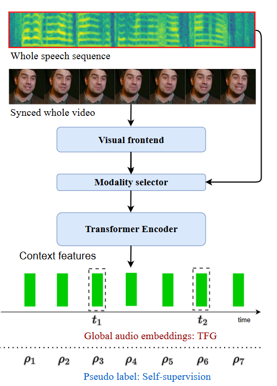

## Seeing What You Said: Talking Face Generation Guided by a Lip Reading Expert

| [code](https://github.com/Sxjdwang/TalkLip) | [paper](https://arxiv.org/abs/2303.17480) |


```citation
Jiadong Wang, Xinyuan Qian, Malu Zhang, Robby T. Tan, and Haizhou Li. 2023. Seeing What You Said: Talking Face Generation Guided by a Lip Reading Expert. DOI:[https://doi.org/10.48550/arXiv.2303.17480](https://doi.org/10.48550/arXiv.2303.17480)
```

会说话的面部生成，也称为语音到嘴唇生成，在给定**连贯的语音输入**的情况下**重建有关嘴唇的面部运动**。 

### Motivation and contribution

先前的研究揭示了唇语同步和视觉质量的重要性，但他们很少关注嘴唇动作的内容，即**所说单词的视觉清晰度**。

- 使用**Lip-Reading Expert**通过**惩罚不正确**的生成结果来提高生成的唇部区域的清晰度。
- 为了弥补数据稀缺，我们以 audio-visual 自监督的方式训练**Lip-Reading Expert**。
- 与**Lip-Reading Expert**一起，提出了一种新颖的对比学习来增强唇语同步和一个 Transformer Encoder 来编码与视频同步的音频，同时考虑音频的全局时间依赖性


TalkLip 网络的框图，该网络在给定连贯的语音输入、身份和姿势输入的情况下生成说话的面孔。该网络由：一个用于音素级特征提取的**音频编码器**； 一个提取身份和姿势信息的**视频编码器**；一个以真实/合成的面部图像为条件的** GAN**；一个来惩罚唇读错误的新颖的后端**唇读专家**组成。整个网络通过**四重损失**进行优化，标记为黄色矩形。 

### lip-reading expert

唇读系统的目标是从视频中的**唇形动作转录单词**序列。
为了解决**数据稀缺**的问题，采用**AV-Hubert**来拥有可靠的唇读专家，这是一种**自监督**的方法，该方法在唇读，语音识别和视听语音识别方面产生了SOTA性能。



Visual frontend 由用于捕获局部唇部运动的3D　CNN　和2D ResNet-18组成。Modality selector 通过屏蔽无参与模态的特征来确定纯音频、纯视频或视听语音识别系统的训练。所有系统共享相同的 Transformer Encoder，并使用相同的逐帧伪标签进行回归。因此，音频和视觉上下文功能是同步的。
AV-Hubert 还提供了一个**同步语音识别系统**，其编码器考虑了**长期的时间依赖性**，我们采用这种编码器对音频输入进行编码。  

### Audio encoder

音频编码器用于对**音素级嵌入**进行编码，并将嵌入提供给生成器作为嘴型和嘴唇运动的参考。
使用**两个不同的音频编码器**来提取嵌入。我们称它们为**本地**和**全局**音频嵌入。


本地音频嵌入是使用基于 CNN 的网络提取的。一个0.2秒的音频片段，其中心与姿势参考同步，作为输入。但是，0.2 秒的音频片段不包含整个语音的时间变化。采用与唇读专家共同训练的Transformer Encoder。Transformer Encoder将**整个语音**作为输入，以生成所有帧的音频上下文特征。然后，我们选择上下文特征的帧，这些帧与姿势参考在时间上对齐，作为全局音频嵌入。

### Video encoder

视频编码器是从图像中提取身份和姿势信息以统一视觉嵌入，并将嵌入提供给生成器以合成与所提供的身份和姿势一致的图像。视觉嵌入是从两个图像中提取的：身份引用和姿势引用。姿势参考与目标面部图像相同，只是它遮盖了下半张脸，以防止我们的 TalkLip 网络学习嘴唇区域的动作。在同一视频序列中随机选取身份引用。两个参考在通道维度中连接起来作为视觉输入，并馈送到基于 CNN 的视频编码器。


### Video generation

生成器在给定音频嵌入和视频嵌入的情况下构建说话人脸图像。生成器由转置的 CNN 块组成。给定合成的说话人脸图像和地面实况图像，应用**两重损耗**来提高视频生成质量，即重建损耗，GAN损失。
$$\mathcal{L}_{rec}=\frac{1}{N_{i}}\sum_{i}^{N_{i}}\lvert v_{i}-v_{i}' \rvert$$
$$\mathcal{L}_{gen}=\mathbb{E}[\log{(1-D(v')}]$$
$$\mathcal{L}_{disc}=\mathbb{E}[\log{(1-D(v))}]+\mathbb{E}[\log{(D(v')}]$$


 

### Lip reading loss

将所有帧以比例p随机采样一组起始帧，其后续M帧将被v′替换。通过这种方式，考虑了 v′ 内以及 v 和 v′ 之间的嘴唇运动。$\mathcal{L}_{lip}=-Y\log{P(\hat{Y}|V)}$ 


### Contrastive loss

给定来自音频编码器的音频嵌入 Ea 和来自唇读专家的视觉上下文特征 R，计算对比损失
$$\theta(x,x')=exp(\mathcal{F}(x)\cdot\mathcal{F}(x')/\tau),$$
$$\mathcal{L}_{av}=-\sum_{i\in \Upsilon}{\log{\frac{\theta(E_{i}^{a},R_{i})}{\theta(E_{i}^{a},R_{i})+\sum_{j\in \Upsilon\\i\neq j}\theta(E_{i}^{a},E_{j}^{a})}}} $$
$$\mathcal{L}_{t}=\lambda_{l}\mathcal{L}_{lip}+\lambda_{c}\mathcal{L}_{av}+\lambda_{r}\mathcal{L}_{rec}+\lambda_{g}\mathcal{L}_{gan}$$


### Experiment


