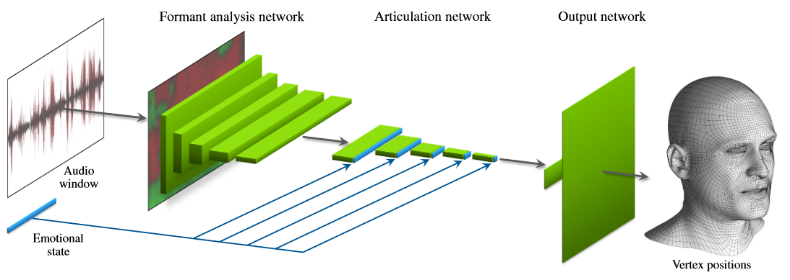
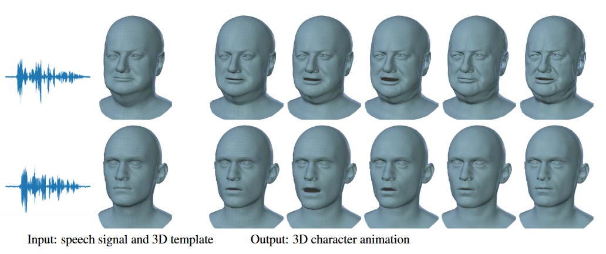
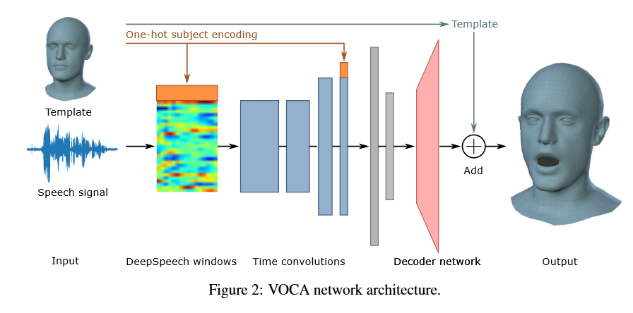
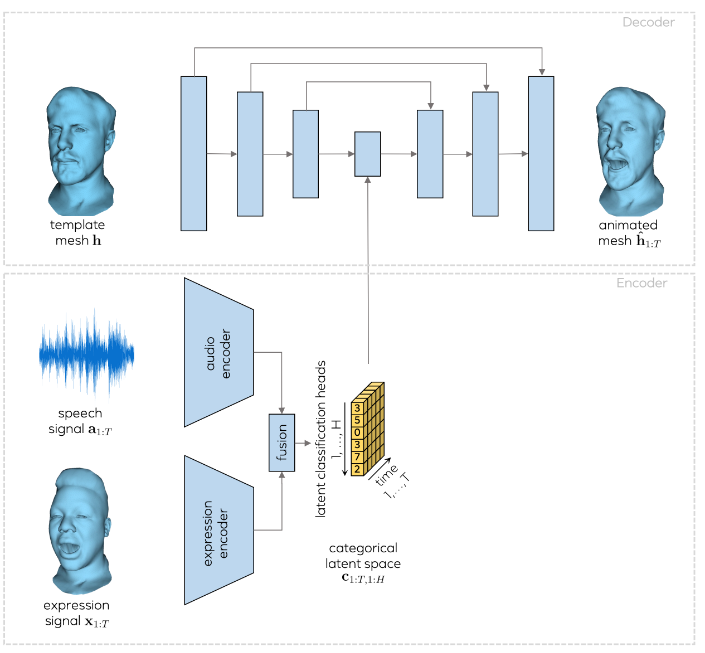
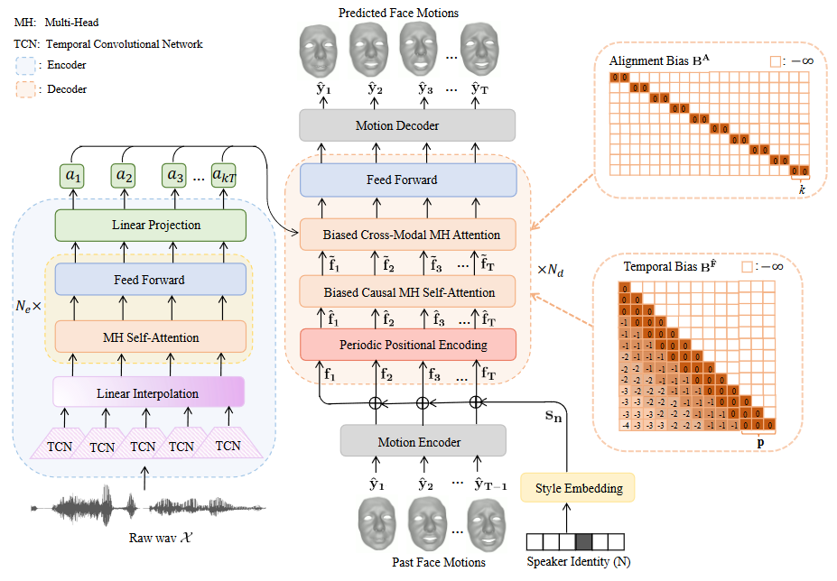
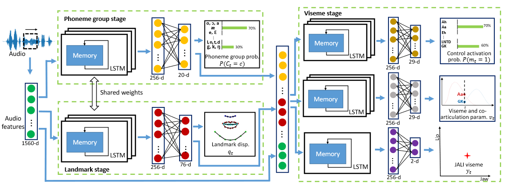
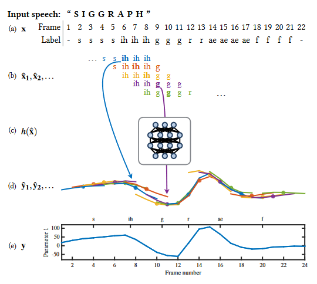
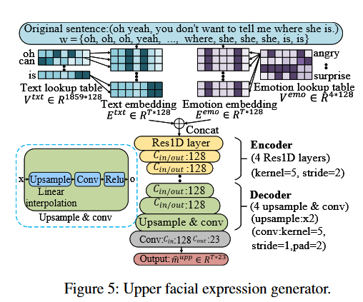

语音驱动是一种常见的3D数字人驱动方式，就是将语音作为驱动源，三维人脸模型作为驱动目标，采用某种深度学习模型，产生三维人脸动画。
具体的语音驱动方式有三种：

1. 语音驱动。将语音输入到深度模型，预测嘴型和面部微表情系数。该方法不受限于不同人、国家，但是受到语音特性（音色、强度、噪声等）影响较大，较难提升模型的泛化能力。
   1. 直接预测mesh序列信息
   2. 预测表情系数或者blendshape系数，最后线性相加合成mesh序列
2. 音素驱动。文本作为驱动源头。将文本时间序列转换成音素时间序列，并输入到深度模型，预测嘴型和面部微表情系数。该此方法与语音无关，只与文本内容相关，不受语音特性变换影响。但是模型受限于不同国家的文本语言（中英等）；同一文本内容、不同类型的合成声音，最后合成的口型及面部表情相似度高，缺乏风格和特性。
   1. 规则方法：按照不同音素发音的方式设定时间平滑规则，使得产生流畅的表情动作。
   2. 深度模型方法：和语音驱动方法类似，需要构建音素到表情系数的映射关系。
3. 语音和音素多模融合驱动。语音和音素同时作为驱动源头。该方法融合语音和文本两个模态的信息，驱动系数更准确，效果更好，但模型更复杂。

## Audio2face

### Audio-Driven Facial Animation by Joint End-to-End Learning of Pose and Emotion 2017

该文提出了一种端到端的卷积网络，从输入的音频直接推断人脸表情变化对应的顶点位置的偏移量。为了解决声音驱动过程中，情绪变化对表情驱动效果的影响，网络自动从数据集中学习情绪状态潜变量。推理阶段，可将情绪潜变量作为用户输入控制参数，从而输出不同情绪下的说话表情。

输入：大约半秒的音频
输出：与音频窗口中心对应的固定拓扑网格的 3D 顶点位置
辅助输入：情绪状态（网络自动从数据集中学习情绪状态潜变量，无需任何形式的预先标记）

### Capture, Learning, and Synthesis of 3D Speaking Styles 2019

输入：音频、静态3D人脸模板
输出：60fps 3D mesh。
语音特征提取：采用DeepSpeech模型。
编码网络：加入了身份信息，拼接one-hot向量到语音特征上。
解码网络：最后的fc层，输出5023*3个顶点的偏移量，加上模板平均脸，得到说话的表情脸。

### MeshTalk: 3D Face Animation from Speech using Cross-Modality Disentanglement 2021

输入：一段音频，一个中性的3D人脸mesh
输出：一段带嘴形和眼部运动的3D人脸动画
核心是面部动画的分类潜在空间，它基于一种新的交叉模态损失来解耦音频相关和音频不相关的信息

### FaceFormer: Speech-Driven 3D Facial Animation with Transformers 2022

偏置交叉模态多头（MH）注意力和具有周期性位置编码策略的偏因果MH自注意。前者有效地对齐音频运动模式，而后者提供了推广到更长音频序列的能力。
输入：一段音频，一个中性的3D人脸mesh
输出：一段带嘴形运动的3D人脸动画。

## Phoneme2face

### VisemeNet: Audio-Driven Animator-Centric Speech Animation 2018

因此，我们提出了一个三阶段网络架构：一个学习从音频预测一系列音素组的架构;另一个学习从音频中预测重要面部特征点的几何位置;最后一个阶段是学习使用音素组和面部特征点来生成 JA-LI 参数值和稀疏语音运动曲线，使面部动画化。

### A Deep Learning Approach for Generalized Speech Animation 2017

从音素 $x$ 的逐帧序列开始作为输入 。

我们将 $x$ 转换为一系列重叠的固定长度输入$(\hat{x_{1}},\hat{x_{2}},...)$

我们应用学习到的预测器对每个$\hat{x_{c}}$进行预测

导致一系列重叠的固定长度输出$(\hat{y_{1}},\hat{y_{2}},...)$

我们通过逐帧平均来混合$(\hat{y_{1}},\hat{y_{2}},...)$

以达到最终输出$y$

### Write-a-speaker: Text-based Emotional and Rhythmic Talking-head Generation

本文首次提出了从文字生成说话人脸视频的算法框架，除了音视频同步的口型，还同时生成了与说话内容匹配的面部表情和与说话节奏匹配度韵律头动。
本文的算法由两个阶段组成：
第一阶段与特定说话人无关，包括三个并行网络，分别用于生成口型、眉眼表情和头部运动三组动作参数；
第二阶段合成特定说话人视频，基于三维人脸信息监督的自适应注意力网络来生成不同特定人的说话视频，此阶段以动作参数作为输入，生成注意力掩码来修改不同说话人的面部表情变化。

由于嘴巴动画主要有助于说出音素而不是语义结构，因此 Gmou 学习了从 ph 到 mmou 的映射
第一步是在更灵活的空间中将 ph 从音素空间转换为嵌入向量 Eph。我们构建了一个可训练的查找表（Tang等人，2014）V ph来实现目标，该表在训练阶段随机初始化和更新。
然后，堆叠的Res1D层以Eph为输入，根据共发音效果输出合成口参数序列mmou。我们基于CNN而不是LSTM设计结构，以实现并行计算的好处。我们应用L1损失和LSGAN损失（Mao et al. 2017）来训练Gmou。

虽然嘴部动作有助于言语共同发音，但上面部表情和头部动作倾向于传达情感、意图和言语节奏。因此，Gupp 和 Ghed 旨在从 w 而不是 ph 捕获更长时间的依赖性。它们共享相同的网络，与Gmou的网络不同，如图5所示。与 V ph 类似，可训练查找表 V txt 将 w 映射到嵌入向量 Etxt。为了生成具有一致情绪的mupp，情绪标签（惊讶，愤怒，中性，幸福）要么由文本情感分类器检测（Yang等人，2019），要么明确分配给特定的情绪类型。另一个可训练的查找表 V emo 将情感标签投影到嵌入向量 Eemo。Etxt和Eemo被馈送到编码器-解码器网络以合成mupp。得益于较大的感受野，编码器-解码器结构可捕获单词之间的长期依赖关系。

### Listen, Denoise, Action! Audio-Driven Motion Synthesis with Diffusion Models
