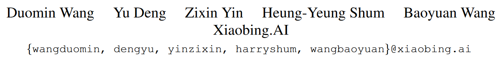

## 用于细粒度可控头部说话合成的渐进式解耦表示学习

| code | [paper](https://openaccess.thecvf.com/content/CVPR2023/html/Wang_Progressive_Disentangled_Representation_Learning_for_Fine-Grained_Controllable_Talking_Head_Synthesis_CVPR_2023_paper.html) |



```citation
Duomin Wang, Yu Deng, Zixin Yin, Heung-Yeung Shum, and Baoyuan Wang. Progressive Disentangled Representation Learning for Fine-Grained Controllable Talking Head Synthesis. Proceedings of the IEEE/CVF Conference on Computer Vision and Pattern Recognition, 2023, pp. 17979–17989.
```

### Background and Motivation
头部说话合成是创建逼真视频头像必不可少的任务，研究人员利用深度学习技术在 [One-shot](../../../Concept/AI/机器学习/迁移学习.md#One-shot%20Learning) 生成生动头像方面取得了巨大进展。相应的方法主要可以分为音频驱动的头颅合成和视频驱动的人脸重现。音频驱动方法更注重从音频信号中准确合成**嘴唇运动**。视频驱动的方法旨在将源视频中的所有面部动作忠实地传输到目标身份，并且通常将这些动作视为**一个整体**，而无需单独控制。

我们认为，对多个面部运动的细粒度和解耦控制是实现逼真的头部说话的关键，在给定相应的驱动信号的情况下，我们可以分别控制**嘴唇运动、头部姿势、眼睛运动和表情**。

在真实场景中，我们想要修改已经合成的会说话的头部的目光，如果我们不能仅仅改变它而是要求演员执行全新的驱动动作，那么成本可能会很高。然而，以一种解耦的方式控制所有这些因素是非常具有挑战性的。例如，嘴唇动作本质上与情绪高度纠缠在一起，而同一言语在不同情绪下的嘴部动作可能会有所不同。

### contribution and novelty
本文提出了渐进式解缠结细粒度可控说话头（PD-FGC），用于 one-shot 头部说话生成，对嘴唇运动、头部姿势、眼睛凝视和眨眼以及情绪表达进行解缠结控制。

其中嘴唇运动的控制信号来自音频，所有其他动作都可以由不同的视频单独驱动。

为此，我们的直觉是学习每个**运动因子**的解开**潜在表示**，并利用图像生成器以这些潜在表示作为输入来合成会说话的头像。

在现有现有模型的帮助下充分利用视频数据中每个运动的固有属性。我们设计了一种渐进式解纠缠表示学习策略，根据各个因素的各自属性以从粗到细的方式分离每个因素控制。它由三个阶段组成：
1. 将外观与面部运动解开，获得记录所有运动信息的**统一运动表示**；
2. 通过**运动特定对比学习**从统一运动特征中分离出除表情之外的每个细粒度面部运动；
3. 通过**特征级去相关**将表情与其他动作分开，并同时学习用于细粒度可控头部说话合成的图像生成器。

#### 外观与运动解耦
为了实现对多个细粒度运动因素的解耦，首要任务是学习一个统一的运动表示，记录各种运动信息，同时排除外观（即身份）信息。

引入外观编码器 $E_{app}$ 和运动编码器 $E_{mot}$ 分别从**外观图像**和**驱动帧**中提取相应的**特征**。应用额外的生成器 $G_{0}$ 来合成具有外观图像的身份和驱动帧的面部运动的面部图像。应用自驱动和重建来学习整个流程，其中将数据增强引入到运动分支中，以迫使运动编码器忽略外观变化并仅关注运动提取。   

$$\mathcal{L}_{m o t}=||\phi(I_{0})-\phi(I_{g})||_{2}+||\psi(I_{0})-\psi(I_{g})||_{2}$$

$\phi(\cdot)$ 和 $\psi(\cdot)$ 是使用3D重构网络和情绪网络提取的特征。$I_{0},I_{g}$ 分别是生成的图像和原图。


#### 细粒度运动解耦
引入了三个额外的编码器来进一步从**统一运动表示**中提取细粒度的运动特征，包括**嘴唇运动特征**、**眼睛注视和眨眼特征**以及**头部姿势特征**。

**嘴唇运动对比学习**
通过探索统一运动特征和相应语音音频之间的共享信息，可以将嘴唇运动与其他运动很好地分开。

给定一组视频帧 $\{v_{i}\}$ 及其对应的音频信号 $\{a_{i}\}$，我们引入唇动编码器 $E_{lip}$ 和音频编码 $E_{aud}$，并提取唇动特征$\{f^{v}_{i}\}=\{E_{lip} \circ E_{mot}(v_{i})\}$和音频特征$\{f^{a}_{i}\}=\{E_{aud}(a_{i})\}$，其中 $E_{mot}$ 是前一阶段的预训练运动编码器。然后，我们为每个采样的音频特征 $f^{a}_{i}$ 构造一个正音视频对$(f^{a}_{i},f^{v}_{i})$和 $K$ 个负音视频对 $(f^{a}_{i},f^{v}_{k}),k\ne i$，反之亦然。引入 [对比学习损失](../../../Concept/AI/损失函数/对比学习损失.md) 来最大化正样本对相似度和最小化负样本对相似度：

$$\mathcal{L}_{a2v}=-\mathrm{log}[\frac{\exp(\mathcal{S}(f_{i}^{a},f_{i}^{v}))}{\exp(\mathcal{S}(f_{i}^{a},f_{i}^{v}))+\sum_{k=1}^{K}{\exp(\mathcal{S}(f_{i}^{a},f_{k}^{v}))}}]$$
$$\mathcal{L}_{v2a}=-\mathrm{log}[\frac{\exp(\mathcal{S}(f_{i}^{v},f_{i}^{a}))}{\exp(\mathcal{S}(f_{i}^{v},f_{i}^{a}))+\sum_{k=1}^{K}{\exp(\mathcal{S}(f_{i}^{v},f_{k}^{a}))}}]$$

$\mathcal{S}(\cdot)$ 是 [余弦相似度](../../../Concept/相似度/余弦相似度.md) 。对比损失确保了对应的音视频提取的运动特征接近彼此，有助于分解嘴唇特征。

**眼睛运动对比学习**
眼睛运动，是局部运动，对其他面部区域的影响有限。因此，从用一个人的眼部区域替换另一个人的眼部区域来合成的新图像提取的眼动特征应该与后一个人的眼动特征相同。

给定两个驱动帧，$v_{1}$ 和 $v_{2}$，通过合成 $v_{1}$ 的眼睛区域和 $v_{2}$ 的其他区域来构造锚点帧 $v_{a}$。使用编码器 $E_{eye}$ 来从上述三帧对应的统一运动表示中提取眼部运动特征 $f_{1}, f_{2}, f_{a}$，构造正对 $(f_{1}, f_{a})$ 和负对 $(f_{2}, f_{a})$，引入对比学习损失：
$$\mathcal{L}_{eye}=-\mathrm{log}[\frac{\exp(\mathcal{S}(f_{1},f_{a}))}{\exp(\mathcal{S}(f_{1},f_{a}))+\exp(\mathcal{S}(f_{2},f_{a}))}]
$$

**头部姿势学习**
头部姿势可以通过由三个欧拉角（即俯仰角、偏航角、滚动角）和 3D 平移组成的 6D 参数来很好地定义，因此我们建议在 3D 面部先验模型的指导下通过头部姿势编码器 $E_{pose}$ 直接对它们进行回归：
$$\mathcal{L}_{pose}=|\mathcal{P}_{pred}-\mathcal{P}_{gt}|_{1}$$
其中 $\mathcal{P}_{pred}$ 是 $E_{pose}$ 预测的姿态参数，$\mathcal{P}_{gt}$ 是通过现成的 3D 人脸重建模型获得的真实姿态参数。

#### 表情解耦


假设提取的表情特征独立于其他动作的特征，同时它与其他动作的组合仍然可以重建驱动信号中的所有面部动作，那么它就是地面表情的精确潜在表示。

提出了一种特征级去相关策略，以将表情与其他动作分开，以及驱动帧的自我重建，以互补的方式学习精确的表情表示。

**In-window decorrelation**
视频序列中的表情变化通常不如其他动作的变化频繁。因此，如果我们在一个时间窗口内取**平均**表情特征，那么存储在表情特征的特定维度中的其他运动信息应该被平均掉，从而得到与其他运动不相关的干净的表情特征。   ^PDFGCTHavg

给定一个驱动帧，我们在其周围定义一个大小为 $K$ 的窗口，并通过随机旋转、缩放和颜色抖动来增强窗口内的帧。通过表情特征编码器 $E_{exp}$ 提取序列表情特征，取平均值作为**中间驱动帧**的**表情特征**。

**Lip-motion decorrelation**
引入了嘴唇运动去相关损失，通过强制表情特征和嘴唇运动特征之间的独立性来实现更好的表情解耦：
$$\mathcal{L}_{decor}={\frac{1}{D}}\sum_{B,D}cor(\bar{F^{e}},F^{a})^{2}$$
其中 $\bar{F^{e}}\in \mathbb{R}^{B\times D}$ 是 $B$ 个批次的平均表情特征组成的矩阵，$F^{a}\in \mathbb{R}^{B\times D}$ 是对应的音频特征矩阵，$D$ 是特征维度，$cor(\cdot,\cdot)$ 计算两个矩阵之间的特征维度相关性。

计算两个变量之间的相关性需要大批量才能达到足够的精度。由于内存限制，在训练过程中很难做到足够大的批大小。

为了解决这个问题，为表情特征和音频特征维护两个存储库用于计算相关性，而不是仅使用当前批次的特征。存储体始终将 $M$ 个最新特征保存在内部以计算相关性。

训练期间，$M$ 远大于每次迭代的批大小。梯度只会通过当前批次的特征反向传播来更新网络权重。


**Complementary learning via self-reconstruction**
上述两种去相关策略保证了表情与其他动作之间的特征**独立性**，但提取的表情特征仍然**缺乏语义意义**。

利用图像生成器$G$将表情特征以及外观和其他运动特征作为输入，并通过驱动帧的自重建来合成具有所需面部运动的图像。

为了准确重建驱动帧，表情编码器被迫学习所有其他运动特征中未包含的补充信息，这正是表情信息。我们强制执行多个损失来学习表达编码器 $E_{exp}$ 和图像生成器 $G$ :
$$\mathcal{L}_{vgg}=\sum_{i=1}^{N}{\parallel VGG_{i}(I_{f})-VGG_{i}(I_{g})\parallel_{1}}$$
$VGGi(\cdot)$ 是预训练 $VGG19$ 网络中第 $i$ 层的特征图。引入对抗性损失和鉴别器特征匹配损失来提高合成图像质量。

为了确保合成图像很好地跟随驱动帧的所有面部运动，进一步引入了运动级一致性损失：
$$\mathcal{L}_{con}=\mathrm{exp}(-\mathcal{S}(\mathcal{V}_{lip}(I_{f}),E_{aud}(a_{g})))+\parallel\mathcal{G}(I_{f}),\mathcal{G}(I_{g})\parallel_{1}+\mathcal{L}_{mot} $$
$E_{aud}$ 是前面训练的音频编码器，$\mathcal{V}_{lip}$ 是预训练的从图像提取嘴唇运动特征的编码器，$\mathcal{G}(I)$ 是凝视估计器，$I_{f},I_{g},a_{g}$ 分别是合成图像，真实图像以及对应的真实音频。

上述自重建过程与特征级去相关策略一起有助于将表情特征与统一运动特征分开。此外，这一步学习到的图像生成器$G$自然地以所有解耦的运动特征和外观特征作为输入，实现了解耦的可控头部合成。因此，将 $G$ 作为头部合成的最终图像生成器。

### Experiment


$$NLSE-C=\frac{LSE\text{-}C^{gen}-LSE\text{-}C^{gt}}{LSE\text{-}C^{gt}}$$


### Thinking

infoNCE Loss 使得无监督在视觉领域能力大大提升。本文在对不同运动特征进行解耦时候使用了多次这个损失函数。作为对比学习损失的一种，通过巧妙设置正负样本对，可以实现灵活的功能。

[窗口去关联](用于细粒度可控头部说话合成的渐进式解耦表示学习.md#^PDFGCTHavg) 采用平均的方法，有一定道理。

在现有现有模型的帮助下充分利用视频数据中每个运动的固有属性。本文使用了多个现有模型，$VGG19,\mathcal{G}(I),\mathcal{V}_{lip},\phi(\cdot),\psi(\cdot)$，充分使用了数据的信息。