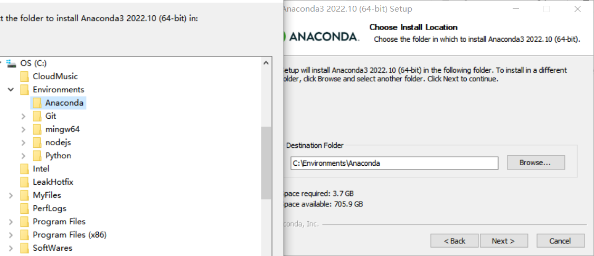
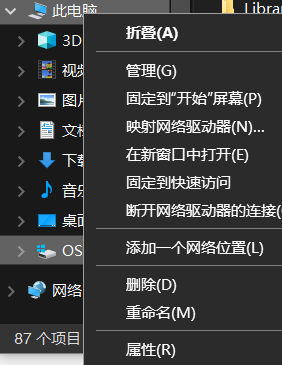
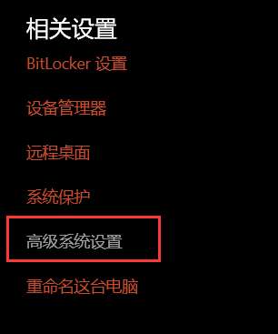
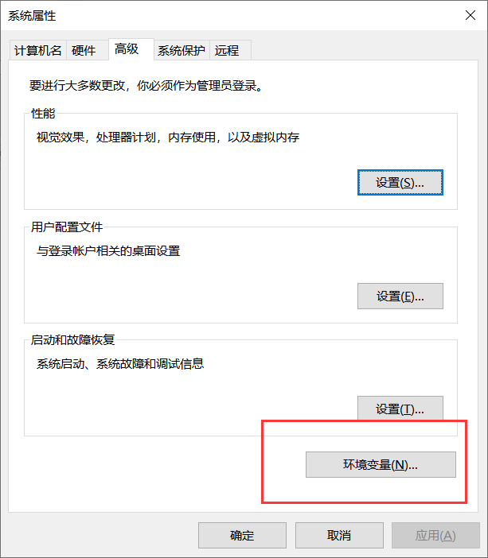
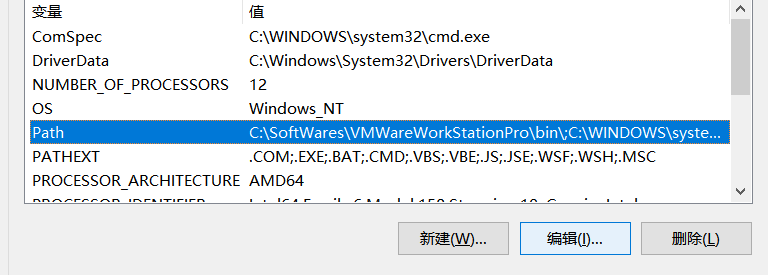
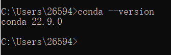
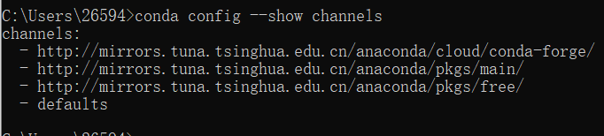

### 1. 下载安装

1. 来到 [anaconda官网](https://www.anaconda.com/) 点击download进行下载。嫌慢的可以来 [镜像站](https://mirrors.zju.edu.cn/) 下载。
2. 运行下载好的程序开始安装，next->agree->next，选择自己希望的安装位置后一路默认完成。

	

3. 配置环境变量。右键此电脑打开属性，打开高级系统设置，打开环境变量

   |  | |  |
   | --- | --- | --- |
   
	选中系统变量中的Path点击编辑，新建，增加两条路径
	

4. 检验win+R打开运行，cmd回车打开终端，如下说明安装成功。

    ```
    conda --version
    ```

	

5. 换源，增加国内下载源以加快速度。可以参考[浙大镜像站](https://mirror.zju.edu.cn/docs/anaconda/)

    ```
    #添加下载源
    conda config --add channels http://mirrors.tuna.tsinghua.edu.cn/anaconda/pkgs/free/
    conda config --add channels http://mirrors.tuna.tsinghua.edu.cn/anaconda/pkgs/main/
    conda config --add channels http://mirrors.tuna.tsinghua.edu.cn/anaconda/cloud/conda-forge/
    #删除默认源
    conda config --remove channels defaults
    ```
    
    
    
6. 查看通道地址
    ```
    conda config --show channels
    ```
    
    此时显示如下
    
    需要关闭defaults通道。找到 .condarc 文件。我的位于 `C:\Users\26594\`文件夹下，用记事本打开，在-defaults前加一个#，保存即可。

	|  |  |
	| --- | --- |


### 2. 使用

1. 常用命令

	| 查看所有虚拟环境 | conda env list |
	| --- | --- |
	| 创建XXX 环境 | conda create -n XXX： |
	| 激活/启用 XXX环境 | activate XXX |
	| 移除XXX环境 | conda env remove -n XXX |
	| 退出当前环境 | conda deactivate |
	| 列出当前环境所以包 | conda list |
	| 安装XXX包 | conda install XXX |
	| 移除XXX包 | conda remove XXX |
	|  |  |
	|  |  |
   
2. 在VSCode中使用conda环境

	cmd中执行
	
	```bash
	conda init powershell
	```

	选择一个文件夹用vscode打开，**ctrl+`**打开终端，执行conda activate XXX即可。
