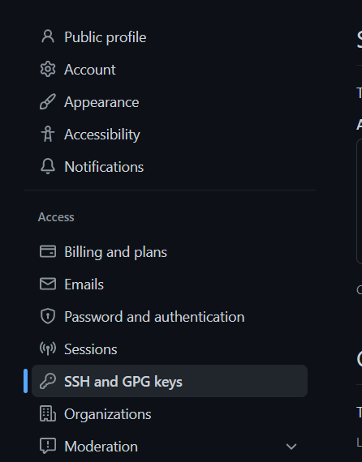

### 一、Windows安装Git

到[Git官网](https://git-scm.com/download/) 下载对应版本进行安装。
除了想更改安装路径的，全部默认即可。<!--more-->

### 二、 Github连接本地

右键打开Git Bash，注意用自己的信息

```bash
#配置注册Github的用户名和邮箱到本地
#在用户文件夹下的.gitconfig文件可以看到

git config --global user.name "guest"
git config --global user.email "email@xx.com"

#生成密钥
ssh-keygen -t rsa -C "email@xx.com"

#回车默认存储位置，回车默认空密码，此时已经生成
#可以在用户文件夹的.ssh文件夹里面查看

#我们将其复制到粘贴板，方便等会粘贴
clip < ~/.ssh/id_rsa.pub
```

在Github头像下面点击Settings，再点击SSH and GPG keys，新建一个SSH，粘贴刚刚复制的密钥即可，名称自己定。

|                                                              |                                                              |
| ------------------------------------------------------------ | ------------------------------------------------------------ |
|  |  |

回到Git Bash测试连接

```bash
ssh -T git@github.com
```

连接成功


### 三、Github Token 生成

TODO