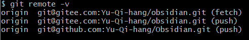

## 背景介绍

为了在多个设备上实现内容的同步，这次是同步 Obisidian 仓库，同时也可以当作一个备份。

关于Git的安装和连接远程平台，参考 [Git安装以及Github连接本地](../../../BLOG/Softwares/Git/Git安装以及Github连接本地.md) 。

避免偶尔出现的 Github 不能访问的情况，选择 Gitee 作为同步和备份平台，同时将 Github 作为备份平台。
## 设置方法

现状是已经有了 Obsidian 笔记仓库，但是没有添加 Git 使用，因此可以在 Gitee 和 Github 分别建立私有的空仓库，不添加任何文件，只获取两个仓库的链接。

进入 Obsidian 的根目录，右键打开 Git Bash，打开 Git 的执行终端，执行下面命令。
```bash
# 初始化仓库
git init
# 添加远程仓库，地址例如：git@gitee.com:Yu-Qi-hang/obsidian.git
git remote add origin <你的Gitee仓库地址>
# 添加github仓库做备份使用
git remote set-url --add origin <Github仓库地址>
```
此时已经设置完毕，下面可以查看设置是否正确

可以看到有一个 fetch 的地址，用于拉去远程仓库的内容用于更新本地仓库
两个 push 的地址，用于每次更新完本地推送备份到远程。

## 使用方法

为了避免遗忘，每次打开某个端的时候，首先在仓库根目录打开 Git Bash 执行拉取，实现本地更新。
```bash
git pull
```
每次本地执行完之后，推送远程仓库进行同步。
```bash
git add .
git commit -m "update"
git push
```
这样子就实现了同步和备份。