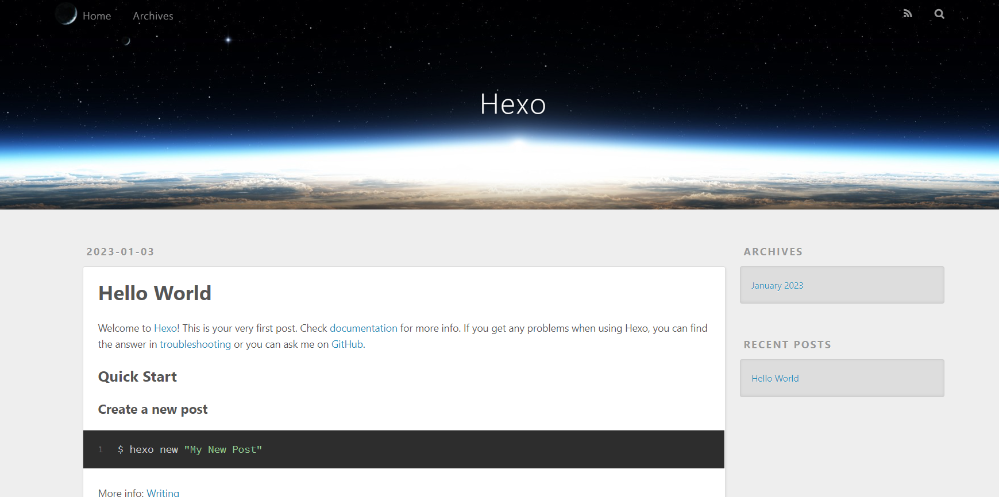
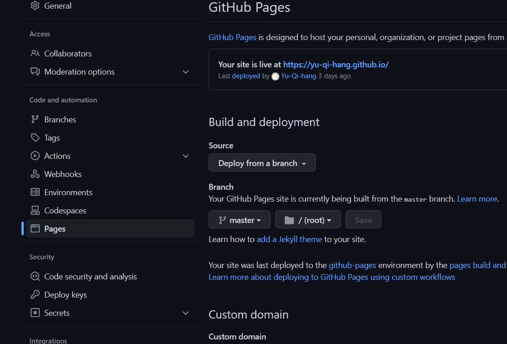
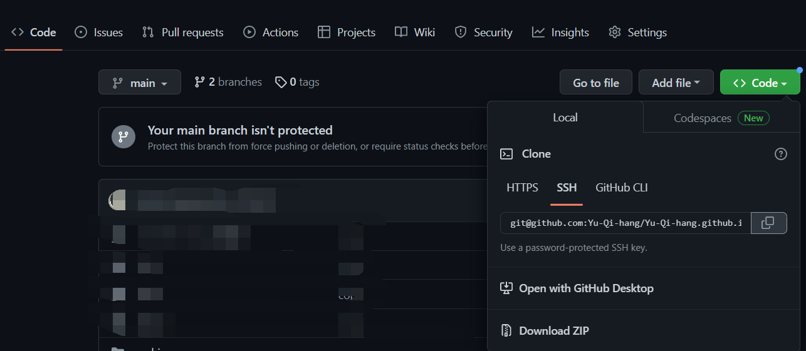

### 一、hexo搭建本地博客


#### 1. 快速搭建hexo博客

需要安装好node.js，可以参考[Nodejs安装以及更新](../Environment/Nodejs安装以及更新.md)，也需要安装好Git，可以参考[Git安装以及Github连接本地](../Git/Git安装以及Github连接本地.md)，之后随便位置右键打开Git Bash。

```bash
npm i -g hexo-cli #安装hexo模块
cd /myfiles #进到希望存放的目录，我是C盘下的Myfiles文件夹
hexo init BLOG #初始化配置
cd BLOG #进入博客根目录
npm install #安装配置插件
hexo g #生成博客
hexo s #本地预览博客
```

此时浏览器输入 `127.0.0.1:4000`就看到了最初的界面 

#### 2. hexo常用命令介绍

| hexo g | generate生成静态网页 |
| --- | --- |
| hexo s | server本地挂载预览网页 |
| hexo d | deploy部署网页到远程服务器 |
| hexo clean | 清理已生成的网页 |


#### 3. hexo博客美化

内容比较多，另外开一篇。


### 二、hexo博客部署到Github Pages


#### 1. 连接Github和本地

参考[Git安装以及Github连接本地](../Git/Git安装以及Github连接本地.md)

#### 2. 新建Github的仓库用于部署网页

1. 登录Github新建一个名为`<username>.github.io`的仓库，这里<username>是指用户名。这样子之后的网页地址就是 `<username>.github.io`，其他名称也可以，不过会变成 `<username>.github.io/repo_name`，记得勾选初始化README。
2. 点击仓库的Settings而不是头像下面的，进入仓库的设置，点击左侧Pages进行配置。


#### 3. 配置本地博客

打开博客根目录的 **\_config.yml** 文件，将最后面部分的进行修改配置，具体仓库地址按照图中复制得到

```yaml
# Deployment
## Docs: https://hexo.io/docs/one-command-deployment
deploy:
  type: ''
```

```yaml
# Deployment
## Docs: https://hexo.io/docs/deployment.html
deploy:
  type: git
  repository: git@github.com:Yu-Qi-hang/Yu-Qi-hang.github.io.git
  branch: master
```


另外Gitee Pages操作类似，但是需要实名认证和申请，另外需要改成。

```yaml
deploy:
  type: git
  repository:
    github: git@github.com:Yu-Qi-hang/Yu-Qi-hang.github.io.git
    gitee: git@gitee.com:Yu-Qi-hang/yu-qi-hang.git
  branch: master
```


#### 4. 部署到远程仓库

```yaml
#安装部署工具
npm install hexo-deployer-git --save
#生成网页，进行部署
hexo g
hexo d
```

每次更新，Github会自动部署，Gitee需要手动点击更新，可以看到部署成功


### 三、保存源码到Github

之前的部署是在master分支，但是现在Github的默认分支是main，因此可以将源码推送到main进行备份。
将当前博客的名称进行修改，随便什么名字。
之后，进入到博客所在目录，执行下面操作

```yaml
git clone <你的博客所在仓库的链接> <你原先的博客文件夹名称>
```

拉取成功之后，cd 进入该目录，可以发现处于main分支

我们把原先博客目录下的东西全部复制到这里，执行下列操作即可推送

```yaml
git add .
git commit -m "000"
git push -f
```

同时执行hexo的命令可以进行部署。
