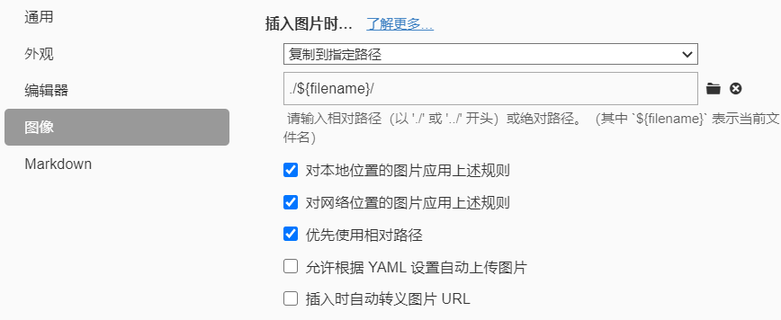

### 背景

之前都是使用的图床，但是有时候加载不稳定，所以现在都是把图片存在本地一起使用。但是hexo生成的静态网页会无法识别路径，因此需要插件辅助实现。
hexo文档有提及方法，但是不是不方便，就是失效。


### 实现

1. 安装插件 `npm install hexo-asset-img --save` 这是在github找到的可用插件
2. 打开配置文件，将 `post_asset_folder` 设置为 `true`
3. 打开typora偏好设置的图像一栏如下图设置，这样子复制的图片就会自动保存到文件同名同目录的文件夹里面，并且自动转义成相对路径
	```
	
	```

