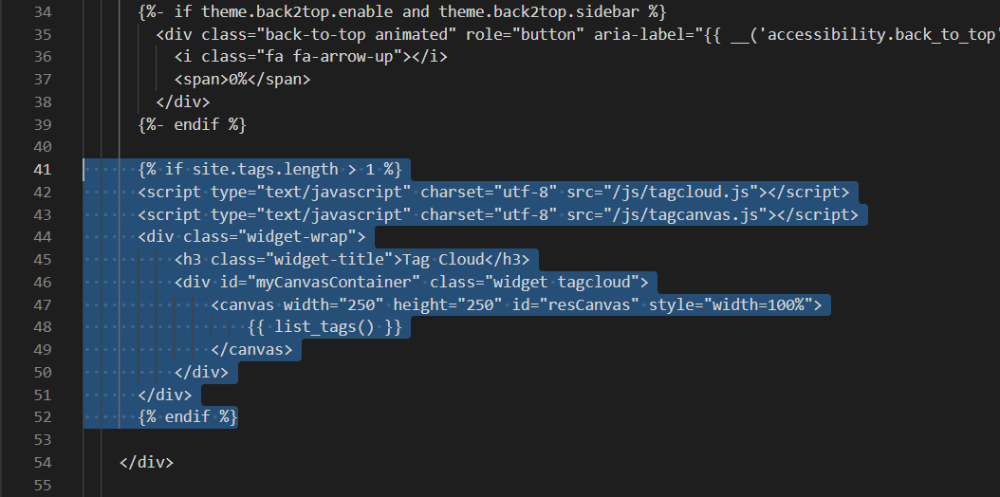
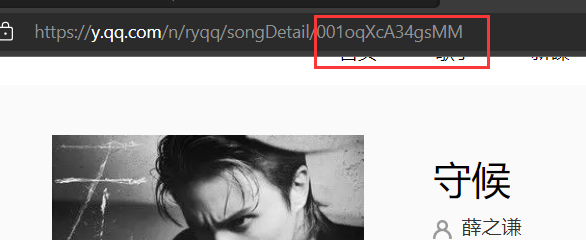
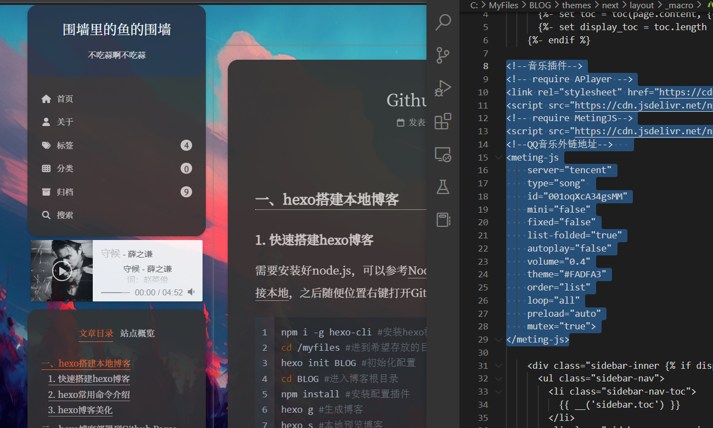
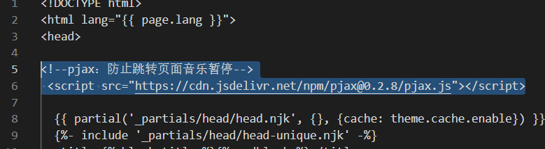

### 一、Hexo主题选择

进入主题网站 <https://hexo.io/themes/> 选择自己喜欢的主题，我选择的是Next主题，比较简洁美观，而且不需要封面图片。
参考github的仓库 <https://github.com/next-theme/hexo-theme-next> 可以进行安装。

1. 进入博客根目录
2. 执行下面代码。

	```yaml
	git clone https://github.com/next-theme/hexo-theme-next themes/next
	```

3. 这时候进入 **themes **文件夹可以发现一个 **next** 文件夹，说明安装成功。
4. 打开 \_config.yml ，拉到最后，找到 theme

	```yaml
	theme: landscape
	#改成
	theme: next
	```

5. 执行网页生成和预览命令可以查看


### 二、个性化配置

参考 [Next使用文档](http://theme-next.iissnan.com/getting-started.html) 进行各种配置。需要注意的是在 Hexo 中有两份主要的配置文件，其名称都是 \_config.yml。 其中，一份位于**站点根目录**下，主要包含 Hexo 本身的配置；另一份位于**主题目录**下，这份配置由主题作者提供，主要用于配置主题相关的选项。
为了描述方便，在以下说明中，将前者称为 **站点配置文件**， 后者称为 **主题配置文件**。

1. 主题配置文件可以选择 scheme，最新版有四种外观，这里选择最新增加的 Gemini。

	```yaml
	# Schemes
	# scheme: Muse
	# scheme: Mist
	# scheme: Pisces
	scheme: Gemini
	```

2. 站点配置文件可以选择语言，这里选择简体中文

	```yaml
	language: zh-CN
	```

3. 在主题配置文件设置菜单，找到 menu，可以先全部打开，显得比较丰富，之后选择性关闭部分菜单页面，但是除了归档页，其他页面都需要自己生成。

	```yaml
	menu:
	  home: / || fa fa-home
	  about: /about/ || fa fa-user
	  tags: /tags/ || fa fa-tags
	  categories: /categories/ || fa fa-th
	  archives: /archives/ || fa fa-archive
	  schedule: /schedule/ || fa fa-calendar
	  sitemap: /sitemap.xml || fa fa-sitemap
	  commonweal: /404/ || fa fa-heartbeat
	```

1. 生成分类页，在博客根目录执行 `hexo new page categories` 即可生成页面，打开根目录下的`source/categories/index.md`，默认内容是

	```yaml
	title: categories
	date: 2023-01-05 22:02:23
	```

2. 我们增加一行，使其变成

	```yaml
	title: categories
	date: 2023-01-05 22:02:23
	type: "categories"
	```

3. 标签页做法类似，只需要把categories改成tags即可，关于页则是生成page about之后自己编辑即可。

4. 在站点配置文件设置个人信息

	```yaml
	title: 围墙里的鱼的围墙
	description: '个人博客'
	author: 围墙里的鱼
	```

5. 在主题配置文件设置个人头像，文件放在主题目录的`source/images/`文件夹下面

	```yaml
	avatar:
	  url: /images/avatar.jpg
	```

6. 侧边栏社交功能，只显示图标

	```bash
	social:
	  GitHub: https://github.com/yu-qi-hang || fab fa-github
	  E-Mail: 2659464450@qq.com || fa fa-envelope
	social_icons:
	  enable: true
	  icons_only: true
	  transition: false
	```

7. 右上角添加fork your github。在themes/next/layout/\_layout.njk中添加代码

	```bash
	#在body的headband div后面添加如下代码
	<div class="forkme">
	  <a href="https://github.com/yu-qi-hang" class="github-corner" aria-label="View source on GitHub"><svg width="80" height="80" viewBox="0 0 250 250" style="fill:#151513; color:#fff; position: absolute; top: 0; border: 0; right: 0;" aria-hidden="true"><path d="M0,0 L115,115 L130,115 L142,142 L250,250 L250,0 Z"></path><path d="M128.3,109.0 C113.8,99.7 119.0,89.6 119.0,89.6 C122.0,82.7 120.5,78.6 120.5,78.6 C119.2,72.0 123.4,76.3 123.4,76.3 C127.3,80.9 125.5,87.3 125.5,87.3 C122.9,97.6 130.6,101.9 134.4,103.2" fill="currentColor" style="transform-origin: 130px 106px;" class="octo-arm"></path><path d="M115.0,115.0 C114.9,115.1 118.7,116.5 119.8,115.4 L133.7,101.6 C136.9,99.2 139.9,98.4 142.2,98.6 C133.8,88.0 127.5,74.4 143.8,58.0 C148.5,53.4 154.0,51.2 159.7,51.0 C160.3,49.4 163.2,43.6 171.4,40.1 C171.4,40.1 176.1,42.5 178.8,56.2 C183.1,58.6 187.2,61.8 190.9,65.4 C194.5,69.0 197.7,73.2 200.1,77.6 C213.8,80.2 216.3,84.9 216.3,84.9 C212.7,93.1 206.9,96.0 205.4,96.6 C205.1,102.4 203.0,107.8 198.3,112.5 C181.9,128.9 168.3,122.5 157.7,114.1 C157.9,116.9 156.7,120.9 152.7,124.9 L141.0,136.5 C139.8,137.7 141.6,141.9 141.8,141.8 Z" fill="currentColor" class="octo-body"></path></svg></a><style>.github-corner:hover .octo-arm{animation:octocat-wave 560ms ease-in-out}@keyframes octocat-wave{0%,100%{transform:rotate(0)}20%,60%{transform:rotate(-25deg)}40%,80%{transform:rotate(10deg)}}@media (max-width:500px){.github-corner:hover .octo-arm{animation:none}.github-corner .octo-arm{animation:octocat-wave 560ms ease-in-out}}</style>
	</div>
	#如果要实现屏幕变小之后不显示，在head的title后面添加如下代码
	  <style>
	  .forkme{
			display: none;
		}
	  @media (min-width: 768px) {
		.forkme{
			display: inline;
		}
	  }
	  </style>
	```

8. 增加版权声明，在主题配置文件中找到下面的并且修改

	```bash
	creative_commons:
	  license: by-nc-sa
	  sidebar: false
	  post: true
	  language:
	```

9. 增加加载进度条，在主题配置文件中找到pace，设为true。


### 三、第三方服务集成


#### 数学公式渲染

主题配置文件把 mathjax 的 enable 设为 true

#### Local Search

修改 BLOG\node\_modules\hexo-generator-searchdb\dist 文件夹下的js后缀为json

```bash
#安装插件
npm install hexo-generator-searchdb --save

#修改站点配置文件
search:
  path: search.json
  field: post
  format: html
  limit: 10000
#修改主题配置文件
local_search:
  enable: true
	top_n_per_article: -1
```


#### 标签云

安装依赖

```bash
npm install hexo-tag-cloud
```

配置文件
在 BLOG\themes\next\layout\_macro\sidebar.njk 文件中添加代码

```bash

<script type="text/javascript" charset="utf-8" src="/js/tagcloud.js"></script>
<script type="text/javascript" charset="utf-8" src="/js/tagcanvas.js"></script>
<div class="widget-wrap">
    <h3 class="widget-title">Tag Cloud</h3>
    <div id="myCanvasContainer" class="widget tagcloud">
        <canvas width="250" height="250" id="resCanvas" style="width=100%">
            {{ list_tags() }}
        </canvas>
    </div>
</div>

```

添加完效果如图


#### 音乐

Next 8.x 已经集成了需要的插件
编辑需要插入的代码

```bash
<!--音乐插件-->
<!-- require APlayer -->
<link rel="stylesheet" href="https://cdn.jsdelivr.net/npm/aplayer@1.10.1/dist/APlayer.min.css">
<script src="https://cdn.jsdelivr.net/npm/aplayer@1.10.1/dist/APlayer.min.js"></script>
<!-- require MetingJS-->
<script src="https://cdn.jsdelivr.net/npm/meting@2.0.1/dist/Meting.min.js"></script> 
<!--QQ音乐外链地址-->   
<meting-js
    server="tencent"
    type="song" 
    id="001oqXcA34gsMM"
    mini="false"
    fixed="false"
    list-folded="true"
    autoplay="false"
    volume="0.4"
    theme="#FADFA3"
    order="list"
    loop="all"
    preload="auto"
    mutex="true">
</meting-js>
```

| **选项** | **默认** | **描述** |
| --- | --- | --- |
| id(编号) | require | 歌曲ID /播放列表ID /专辑ID /搜索关键字 |
| server(平台) | require | 音乐平台：netease，tencent，kugou，xiami，baidu |
| type（类型） | require | song，playlist，album，search，artist |
| auto（支持类种 类） | options | 音乐链接，支持：netease，tencent，xiami |
| fixed（固定模式） | false | 启用固定模式 |
| mini（迷你模式） | false | 启用迷你模式 |
| autoplay（自动播放） | false | 音频自动播放 |
| theme(主题颜色) | `#2980b9` | 默认#2980b9 |
| loop（循环） | all | 播放器循环播放，值：“all”，one”，“none” |
| order(顺序) | list | 播放器播放顺序，值：“list”，“random” |
| preload(加载) | auto | 值：“none”，“metadata”，“'auto” |
| volume（声量） | 0.7 | 默认音量，请注意播放器会记住用户设置，用户自己设置音量后默认音量将不起作用 |
| mutex（限制） | true | 防止同时播放多个玩家，在该玩家开始播放时暂停其他玩家 |
| lrc-type（歌词） | 0 | 歌词显示 |
| list-folded（列表折叠） | false | 指示列表是否应该首先折叠 |
| list-max-height（最大高度） | 340px | 列出最大高度 |
| storage-name（储存名称） | metingjs | 存储播放器设置的localStorage键 |

这就是ID的获取方式，其他平台类似

插入代码到需要的位置，打开主题文件夹下的 `layout/_macro/sidebar.njk`   文件，插入到如图所示位置，不同位置会导致显示位置不同。
为了避免切换页面引起重新播放，需要进行全局设置，在主题文件夹下的 `layout/_layout.njk` 里面添加

```bash
<!--pjax：防止跳转页面音乐暂停-->
 <script src="https://cdn.jsdelivr.net/npm/pjax@0.2.8/pjax.js"></script>
```


在主题配置文件中修改 `pjax: true`。
该操作有一个问题，本质上是是sidebar不刷新，因此进入新页面会导致sidebar依然显示站点概览而不是文章目录，所以我去掉了该功能。
