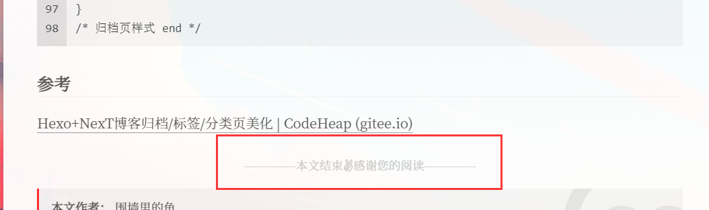

### 一、目的

在文末添加阅读完成的提示，效果如下



<!--more-->

### 二、方法

1. 在 `themes/next/layout/_macro/` 中新建 `passage-ebd-tag.njk` 写入以下内容

   ```css
   <div>
       
           <div style="text-align:center;color: #ccc;font-size:14px;">-------------本文结束<i class="fab fa-angellist"></i>感谢您的阅读-------------</div>
       
   </div>
   ```

   

2. 打开 `themes/next/layout/_macro/post.njk` ，在 post-body和post-footer之间添加如下代码

   ```css
   <div>
     
       
     
   </div>
   ```

   

3. 在主题配置文件中添加如下代码

   ```yaml
   # 文章末尾添加“本文结束”标记
   passage_end_tag:
     enabled: true
   ```

   

### 参考

[hexo笔记七：next主题添加版权声明_小镇攻城狮的博客-CSDN博客_next 版权声明](https://blog.csdn.net/Awt_FuDongLai/article/details/107430942)