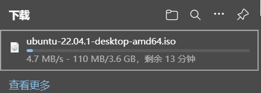
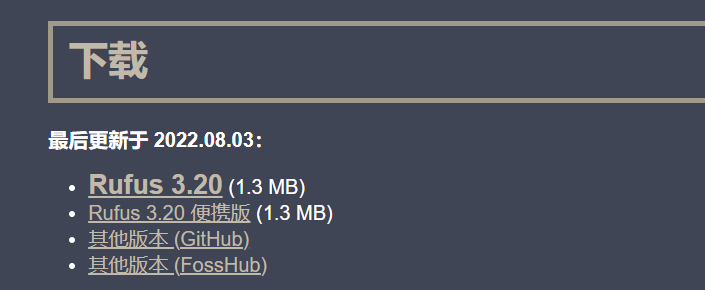
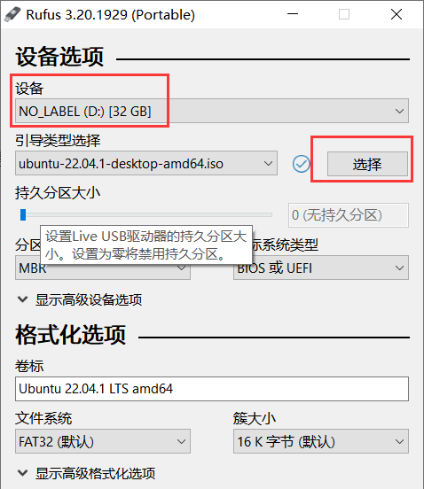
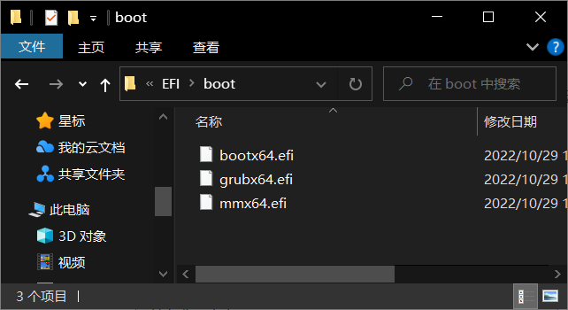
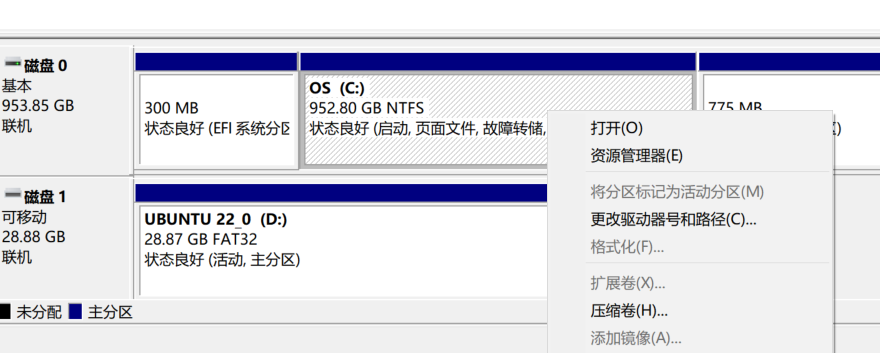
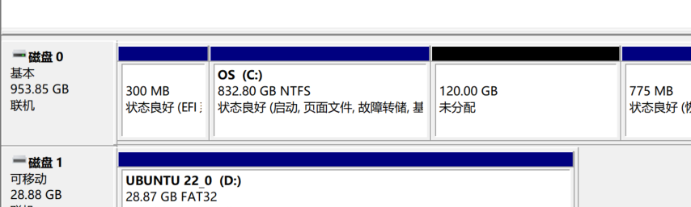
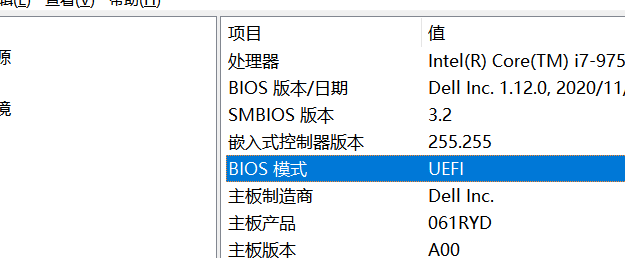

### 1. 下载镜像文件

进入 [Ubuntu下载链接](https://cn.ubuntu.com/download/desktop) 下载22.04版本，等待下载完成。



### 2. 下载安装镜像工具

进入 [rufus官网](https://rufus.ie/zh/#google_vignette) 下载便携版即可。



### 3. 安装盘制作

打开上面下好的软件，准备一个4G以上空U盘。连接后会自动识别到U盘盘符。

点击上图红色框选择镜像，找到下好的镜像文件点击打开。确保已经不需要U盘内的资料，点击开始。

安装完成。


### 4. 磁盘分区

右键开始菜单，打开磁盘管理。我只有一个SSD，因此只需要分出一块分区。右键分区，选择压缩卷。

1024*120个MB空间



### 5. 查看磁盘格式

win+r 打开运行，输入 msinfo32 ，查看bios模式。



### 6. 安装双系统

重启计算机，进入bios，我的是dell，一直按f12即可。选择UEFI一栏回车。进入了安装系统，选择语言为中文简体，点击安装Ubuntu。之后选择English(US)，继续。安装软件时候选择最小安装即可。


### 7. 软件安装

按照引导完成安装之后进行联网，软件安装。

```shell
sudo apt update				#拉取更新
sudo apt install vim	#安装vim
sudo apt upgrade			#更新软件
```

安装了edge进行了登录和同步。


### 8. 时间同步

Ubuntu 与 Windows 时间确定机制不同，需要进行同步。

```shell
sudo apt install ntpdate #安装同步工具
sudo ntpdate time.windows.com #更改时间确定机制
sudo hwclock --localtime --systohc #同步硬件时间
```


### 9. 参考视频

[Windows 和 Ubuntu 双系统的安装和卸载\_哔哩哔哩\_bilibili](https://www.bilibili.com/video/BV1554y1n7zv/?spm_id_from=333.337.search-card.all.click\&vd_source=bab75b3ccf1b5ff4356ab5c39c33eca7)
上视频使用的安装工具在我得U盘不行，于是按照下面视频制作U盘，U盘文件系统为FAT32。与上边视频不同的操作就是软件安装时选择了最小安装，以及分配空间时候有自己想法。

[Win10与Ubuntu双系统安装（绝对新手向）\_哔哩哔哩\_bilibili](https://www.bilibili.com/video/BV1F44y1m7ZL/?spm_id_from=333.337.search-card.all.click\&vd_source=bab75b3ccf1b5ff4356ab5c39c33eca7)
