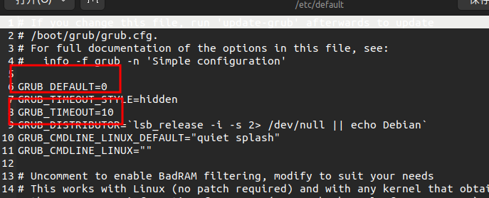

### 一、更改默认启动项

ctrl+alt+T 打开终端，输入下面代码打开配置文件

    sudo gedit /etc/default/grub

此处为 `0`表示ubuntu为默认系统，改为`2`即windows为默认系统。
`10`表示等待时间为10s

最后运行改行代码实现更新，重启发现更改成功。

```shell
sudo update-grub
```


### 二、界面美化

到 [这里](https://www.gnome-look.org/browse?cat=109\&ord=latest) 下载喜欢的主题，我选了 [BigSur GRUB Theme](https://www.gnome-look.org/p/1443844) 有点慢。
解压缩主题文件夹，进入 `install.sh`所在文件夹右键打开终端，执行以下命令进行安装

```shell
./install.sh
```

配置文件

```shell
sudo vim /etc/default/grub #打开配置文件
```

	配置主题和分辨率

```shell
GRUB_CFXMODE="1920*1080"
GRUB_THEME="/boot/grub/themes/bigsur/theme.txt"
```

更新配置

```shell
sudo grub-mkconfig -o /boot/efi/EFI/ubuntu/grub.cfg
sudo update-grub
```
