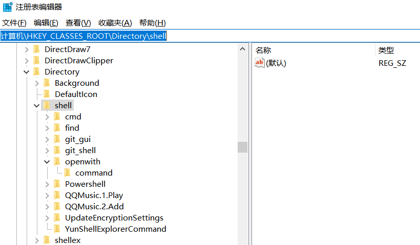

在win系统中，右键文件有一个选项为打开方式，点击可以选择打开文件的方式，但是右键文件夹没有此功能。下面介绍一下如何增添此功能。<!--more-->

1. **win+r** 打开运行
2. 输入 **regedit** 回车进入注册表
3. 找到这个目录 **HKEY\_CLASSES\_ROOT\Directory\shell**
4. 右键shell新建项，命名为openwith，在右边那一栏里双击默认那两个字，在出来的文本框里输入“打开方式”或者其他什么想要右键能看到的提示。
5. 右键openwith新建项，命名为**command**，在右边那一栏里有个默认，双击它，在数值数据那里输入
   1. “C:\Windows\rundll32.exe Shell32.dll,OpenAs\_RunDLL %1”或者
   2. “C:\Windows\System32\rundll32.exe Shell32.dll,OpenAs\_RunDLL %1”
6. 到底输入哪个的话，自己搜索电脑里面哪个位置存在 **rundll32.exe**
7. 效果如下：只需要点击该项就会弹出选择窗口，选择打开方式。

想法的产生开始于对文件夹增加右键的VSCode打开方式之后，又增加Typora打开方式。想到这样子如果之后还要加，显得过于累赘，为什么不能像右键文件一样可以选择打开方式呢？于是借鉴了右键文件增加打开方式的方法，实现了该功能。
