### 背景

使用阿里云盘自带的视频播放有很多限制，而且使用体验极差。但是potplayer可以有很多个性化播放设置。想在本地播放阿里云盘中的视频需要下载的话很麻烦，因此借助alist将云盘挂载到本地，再调用potplayer的网络媒体播放功能直接播放。<!--more-->

### 更新

阿里云盘开发官方api通道，到 https://github.com/alist-org/alist/releases 下载最新版进行安装，Windows的是直接覆盖即可，如何按照官方文档的阿里云盘open进行配置即可。

### 实现步骤

#### 1. Alist下载安装与运行

[提取码：2u88](https://www.aliyundrive.com/s/dLPP5VxLpTN)
下载之后拖动到自己喜欢的地方存起来，比如我存在这里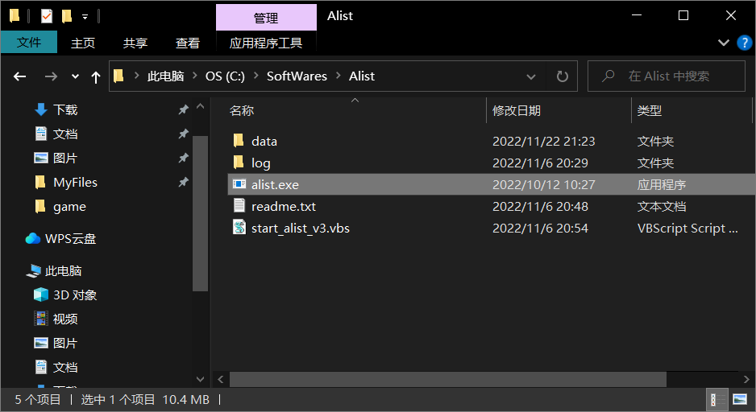
点击资源管理器路径位置输入**cmd** 回车打开终端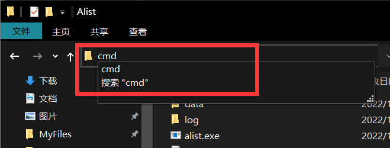
输入 **alist.exe server**回车运行程序，记住密码和端口号

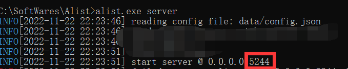 

#### 2. Alist配置

> 浏览器输入 **127.0.0.1:5244**进入配置界面，用户名为admin，密码为刚才终端显示的密码，登录。可以在管理面板修改密码，按照[阿里云盘](https://alist.nn.ci/zh/guide/drivers/aliyundrive.html)进行配置如下：

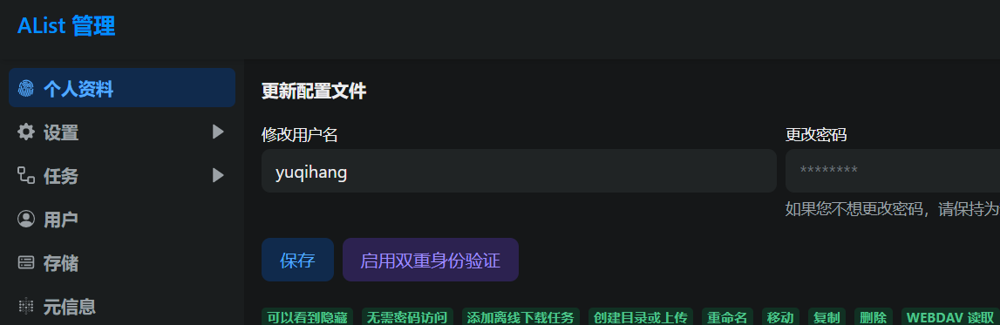

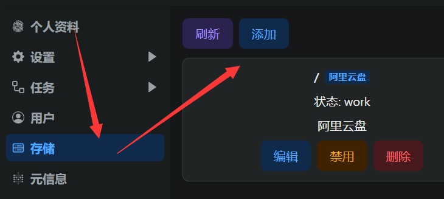

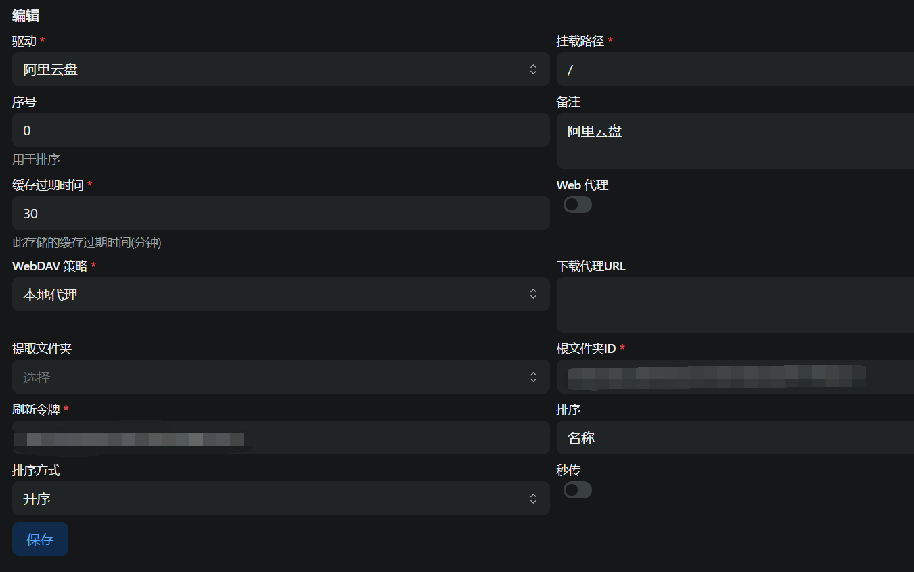

关于挂载路径，可以自己定义，我挂载了多个云盘，就选择把阿里云盘的两个账号分别设置为 `/aliyun/0` 和 `/aliyun/1`。
下面介绍根文件夹和刷新令牌获取方式

1. 刷新令牌：登录网页版阿里云盘，f12打开开发者模式，按照如同方式找到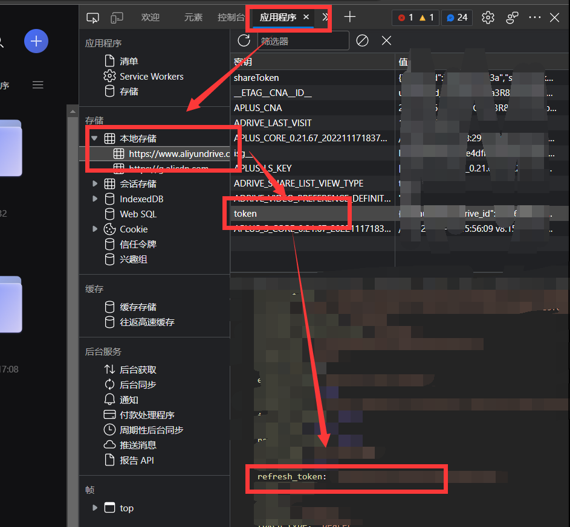
2. 根文件夹：进入自己希望挂载的文件夹，我想挂的是video那么进入之后地址folder/后面的一串就是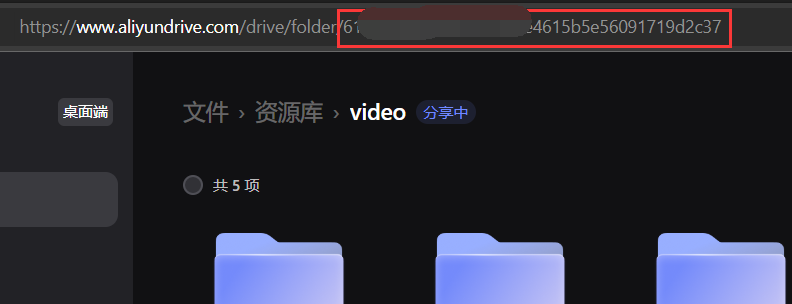

对于**阿里云盘分享**挂载，好处是不用转存到自己的云盘，占用空间，缺点是他人解除分享之后会失效。操作和上述过程相同，但是多一项叫做 **分享ID**的项目，是指 **/s/.../folder**中的...部分。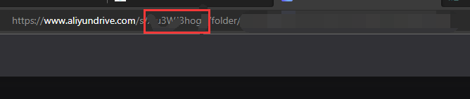 

####  3. potplayer添加播放

[提取码：1p6i](https://www.aliyundrive.com/s/motNMUBjym6) 下载完成之后双击解压即可使用，是便携版软件。把文件夹放到喜欢的地方，创建PotPlayerMini64.exe的快捷方式，放到

C:\Users\用户名\AppData\Roaming\Microsoft\Windows\Start Menu\Programs 

里面

如图配置，账号密码为自己刚刚保存的账号密码，即可完成
如果上一步的挂载路径是其他形式，以我的 `/aliyun/1`为例，这路的路径就应该改为 `127.0.0.1/dav/aliyun/1`。
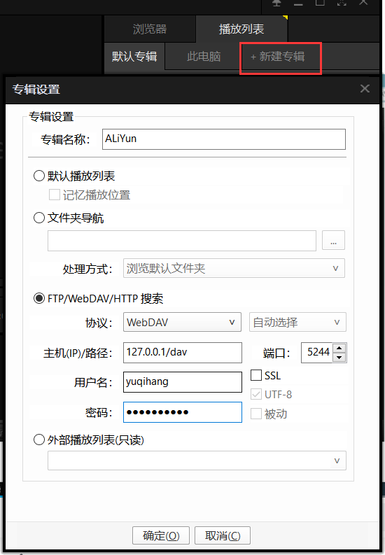 

#### 4. 开机自启挂载程序

[提取码：62ow](https://www.aliyundrive.com/s/GWGGZuckdpF) 下载这个脚本和alist.exe放到一个文件夹里面，创建这个脚本的快捷方式，电脑win+r 输入shell:startup，将快捷方式放进电脑的启动文件夹内。

|                                                              |                                                              |
| ------------------------------------------------------------ | ------------------------------------------------------------ |
| 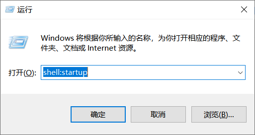 | 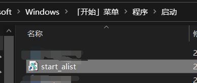 |

 

### 参考资料

1. [【Alist网盘挂载】电脑端Alist挂载网盘资源并实现webdav播放\_哔哩哔哩\_bilibili](https://www.bilibili.com/video/BV1vd4y117CV/?spm_id_from=333.999.0.0\&vd_source=bab75b3ccf1b5ff4356ab5c39c33eca7)
2. [阿里云盘](https://alist.nn.ci/zh/guide/drivers/aliyundrive.html)

