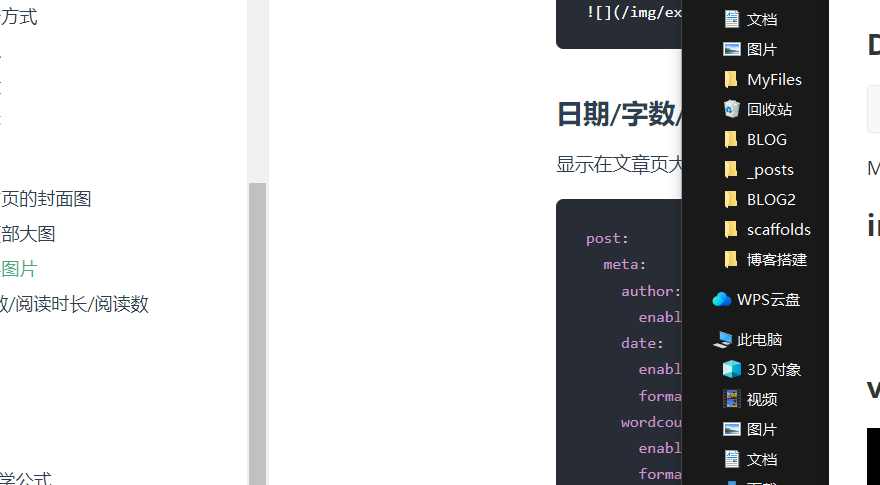

Welcome to [Hexo](https://hexo.io/)! This is your very first post. Check [documentation](https://hexo.io/docs/) for more info. If you get any problems when using Hexo, you can find the answer in [troubleshooting](https://hexo.io/docs/troubleshooting.html) or you can ask me on [GitHub](https://github.com/hexojs/hexo/issues).

## Quick Start

### 公式

$$
\lim_{x\rightarrow 0^{+}}{\frac{1}{x^{a}}}
$$

$\lim_{x\rightarrow 0^{+}}{\frac{1}{x^{a}}}$

### 代码

```c
#include<stdio.h>
int main(){
    return 0;
}
```


### image




### video

<iframe src="//player.bilibili.com/player.html?bvid=BV1vb4y1p7k6&page=1" scrolling="no" border="0" frameborder="no" framespacing="0" allowfullscreen="true"  style="position: relative; width: 100%;height: 100%"> </iframe>


### 部署

<a href="https://yu-qi-hang.github.io">切换主题</a>