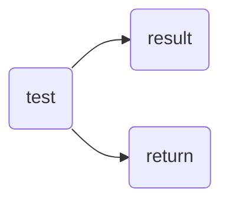

Welcome to [Hexo](https://hexo.io/)! This is your very first post. Check [documentation](https://hexo.io/docs/) for more info. If you get any problems when using Hexo, you can find the answer in [troubleshooting](https://hexo.io/docs/troubleshooting.html) or you can ask me on [GitHub](https://github.com/hexojs/hexo/issues).

<!-- more -->

## Quick Start

### 公式

$$
\lim_{x\rightarrow 0^{+}}{\frac{1}{x^{a}}}
$$

$\lim_{x\rightarrow 0^{+}}{\frac{1}{x^{a}}}$

### 代码

```c
#include<stdio.h>
int main(){
    return 0;
}
```


### 图片


### 视频

<iframe src="//player.bilibili.com/player.html?aid=990700650&bvid=BV1cx4y1M7ci&cid=975414937&page=1" scrolling="no" border="0" allowfullscreen="true"> </iframe>


### 绘图



<a href="https://yu-qi-hang.github.io/posts/4a17b156/">切换主题</a>