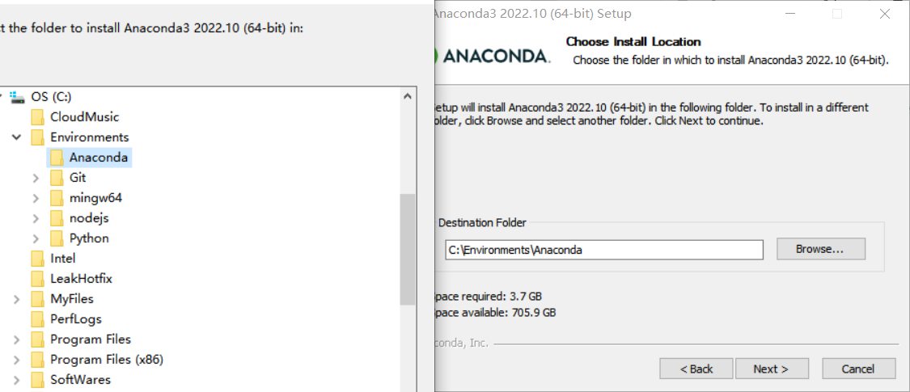
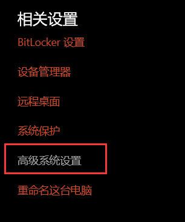
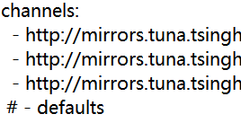

### 1. 下载安装

1. 来到 [anaconda官网](https://www.anaconda.com/) 点击download进行下载。嫌慢的可以来 [镜像站](https://www.anaconda.com/) 下载。<!--more-->
2. 运行下载好的程序开始安装，next->agree->next，选择自己希望的安装位置后一路默认完成。

3. 配置环境变量。右键此电脑打开属性，打开高级系统设置，打开环境变量
   
   |                                                              |                                                              |                                                              |
   | ------------------------------------------------------------ | ------------------------------------------------------------ | ------------------------------------------------------------ |
   |  |  |  |
   
   

选中系统变量中的Path点击编辑，新建，增加两条路径

4. 检验win+R打开运行，cmd回车打开终端，如下说明安装成功。

    conda --version

5. 换源，增加国内下载源以加快速度。

    #添加下载源
    conda config --add channels http://mirrors.tuna.tsinghua.edu.cn/anaconda/pkgs/free/
    conda config --add channels http://mirrors.tuna.tsinghua.edu.cn/anaconda/pkgs/main/
    conda config --add channels http://mirrors.tuna.tsinghua.edu.cn/anaconda/cloud/conda-forge/
    #删除默认源
    conda config --remove channels defaults
    # 查看通道地址
    conda config --show channels

此时显示如下

需要关闭defaults通道。找到 .condarc 文件。我的位于C:\Users\26594\文件夹下，用记事本打开，在-defaults前加一个#，保存即可。

|                                                              |                                                              |
| ------------------------------------------------------------ | ------------------------------------------------------------ |
|  |  |

### 2. 使用

1. 常用命令
   | 查看所有虚拟环境 | conda env list |
   | --- | --- |
   | 创建XXX 环境 | conda create -n XXX： |
   | 激活/启用 XXX环境 | activate XXX |
   | 移除XXX环境 | conda env remove -n XXX |
   | 退出当前环境 | deactivate |
   | 列出当前环境所以包 | conda list |
   | 安装XXX包 | conda install XXX |
   | 移除XXX包 | conda remove XXX |
   |  |  |
   |  |  |

2. 在VSCode中使用conda环境

cmd中执行

    conda init powershell

选择一个文件夹用vscode打开，ctrl+\` 打开终端，执行conda activate XXX即可。
