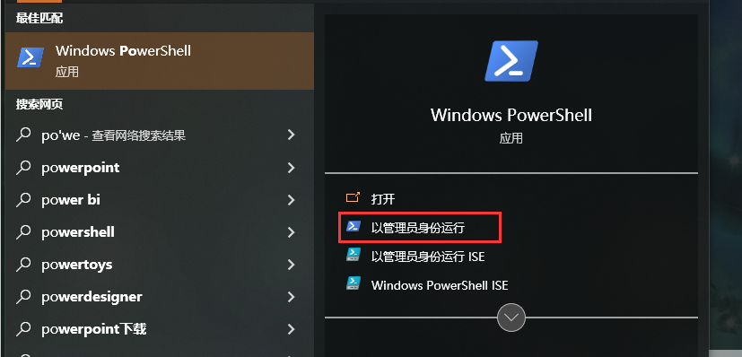

### 背景

由于Microsoft store太卡了，照着网上教程乱弄，一次重启之后发现商店消失。 <!--more-->

### 步骤

1. win键之后输入`windows powershell`，点击用管理员打开。
2. 输入 `Get-AppxPackage -allusers | Select Name, PackageFullName`，查看Microsoft.WindowsStore 右侧对应的文件名，复制下来
3. 输入`Add-appxpackage -register "C:\Program Files\WindowsApps\刚刚复制的文件名\appxmanifest.xml" -disabledevelopmentmode`，回车。出现一闪而逝的绿色，表面部署完成，可以发现已经安装。
