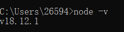

### 安装

1. Windows系统不能直接通过命令行安装Node.js，需要下载安装包进行安装。
2. 官网下载非常缓慢，因此推荐到 [Node.js中文网](http://nodejs.cn/download/) 进行下载。<!--more-->
3. 下载之后除了安装路径可以自己选择一下，其他默认即可。
4. 安装完成之后win+r呼出运行，输入cmd回车，输入 `node -v` 查看是否安装成功。这样子就是成功了。
5. npm服务器在国外，使用非常慢，进行换源，换成阿里的

```bash
npm config set registry https://registry.npm.taobao.org　#换源
npm config list	#查看是否换源成功
```

### 更新

1. 更新就是和安装一样，下载新版本安装包，安装到旧版本安装位置自动覆盖即可。
