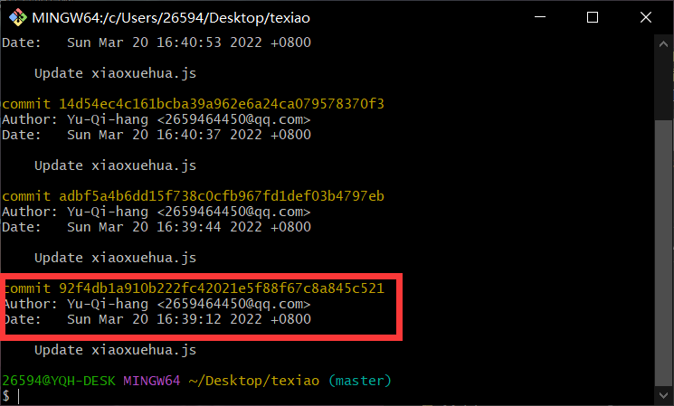
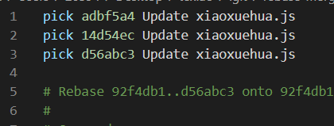
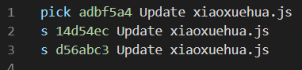
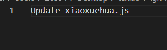

### 一、目的

有时候很多简短的commit完全可以合并，没必要独占一个。有时候分支开发之后，想要合并，合并成一个commit更方便。<!--more-->

### 二、步骤

首先查看有哪些个commit，在git bash执行

```bash
git log
```

一页显示不完，可以通过 `enter` 或者 `↓` 往下翻。按 `q` 推出翻页。



如图，有很多同名commit，我现在希望将红框上面的全部合并，那我就执行

```bash
git rebase -i 92f4db1a910b222fc42021e5f88f67c8a845c521
```

最后的一串字符就是红色框中的一串，这是 commit 的 ID。

这时候会自动打开编辑器，看到如图左界面，我们将处第一个之外的 `pick` 都改成 `s` ，如图右，保存之后关闭编辑器。

|                                                  |                                                  |
| ------------------------------------------------ | ------------------------------------------------ |
|  |  |

这时会重新打开编辑器，需要编辑合并之后的commit内容，我们留下一句，保存之后关闭编辑器



再看一下，会发现已经合并了前面三个commit为一个新的commit

