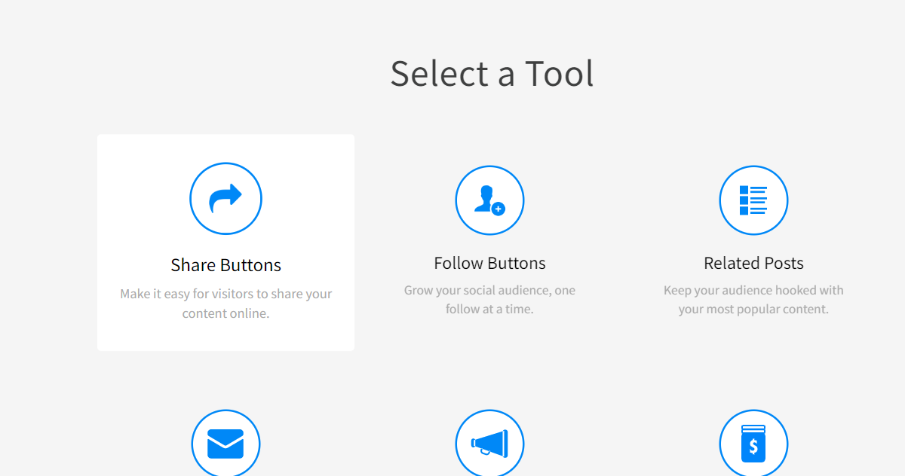
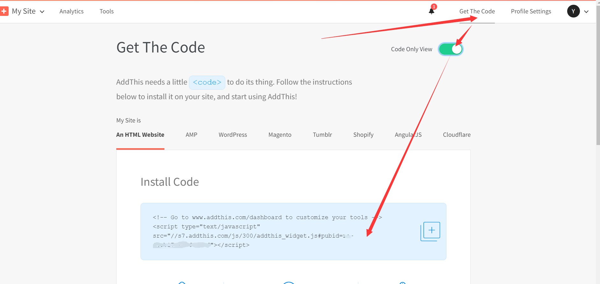
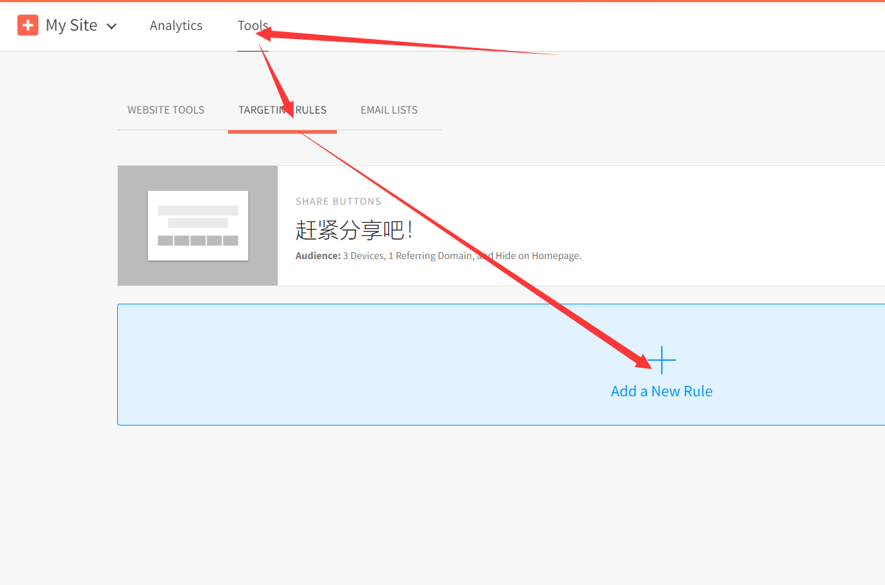
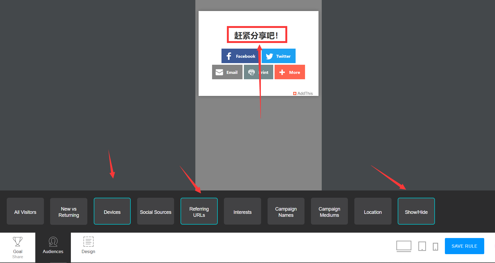

Next中集成了 `AddThis Share` ，但是需要进行配置。

下面是配置的步骤。

1. 来到 [Addthis 官网](https://www.addthis.com/) 完成注册。
2. 选择工具选择 `Share Buttons` <!--more-->
3. 选择一种工具类型，一共有七种样式，我选择 `Expanding` ，然后 continue。
4. 四个栏目分别设置分享的目标，颜色，分享按钮位置以及隐藏分享的页面，配置完成。
5. 获取配置所需ID，也就是模糊部分 
6. 点击定位规则添加定位规则配置，配置设备，博客地址，名字以及隐藏的页面 
7. 打开主题配置文件，将刚刚的pubid配置到 `add_this_id` 。

完成了，但是好像不太好用，不会自动唤起QQ和微信，还需要扫码之类，太麻烦了，去掉了。

参考：[Hexo搭建博客NexT主题之AddThis分享文章的配置](https://jasonssun.github.io/2019/06/15/Hexo搭建博客NexT主题之AddThis分享文章的配置/)
