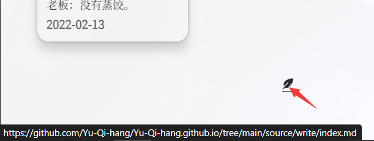

### 一、配置Git Action

#### 1. 什么是Git Action

**Git Action** 是Github 提供的一个功能，只要做好配置文件，就能够自动将该仓库的代码拉取到服务器进行执行。

基于此，可以将hexo博客的部署进行自动化，只需要每次上传源代码文件即可自动部署。<!--more-->

具体的讲解可以参考官方文档 [Understanding GitHub Actions - GitHub Docs](https://docs.github.com/en/actions/learn-github-actions/understanding-github-actions) 。

#### 2. 配置yml

在博客根目录下面新建 `.github/workflows/随便什么名字.yml` 配置好yml文件之后，每次只要push到remote就会自动识别执行。

在网上找了很多配置教程，但是都失败了，查看 <font color=red>ERROR</font> 发现的原因有如下：

1. Windows系统下的文件转到Linux之后无法正常识别。我的电脑是Windows，但是找到的教程全部都是使用的 `runs-on: ubuntu-latest` 。
2. 配置的私钥无法被正常识别，导致action服务器无法正确访问GitHub服务器。

我的配置代码如下

```yaml
# workflow name
name: Hexo Blog CI

# main branch on push, auto run
on: 
  push:
    branches:
      - main

env:
  TZ: Asia/Shanghai

jobs:
  build: 
    runs-on: windows-latest 
        
    steps:
    # check it to your workflow can access it
    # from: https://github.com/actions/checkout
    - name: Checkout Repository main branch
      uses: actions/checkout@main
      
    # from: https://github.com/actions/setup-node  
    - name: Setup Node.js 18.x 
      uses: actions/setup-node@main
      with:
        node-version: "18.x"

    - name: Setup Hexo Dependencies
      run: |
        npm install hexo-cli -g
      #  npm install
    
    - name: Generate files
      # 编译 markdown 文件
      run: |
        hexo clean
        hexo generate

    - name: Deploy hexo blog
      # 将编译后的博客文件推送到指定仓库
      run: |
        cd ./public && git init && git add .
        git config --global user.name '<用户名>' 
        git config --global user.email '<注册邮箱>'
        git add .
        git commit -m "GitHub Actions Auto Builder at $(date +'%Y-%m-%d %H:%M:%S')"
        git push -f --quiet "https://${{ secrets.ACCESS_TOKEN }}@github.com/<用户名>/<用户名>.github.io" master:master
```

下面解释一下：

1. `<>` 以及之间的内容是需要自己填写的，例如我的就是 `git config --global user.name 'Yu-Qi-hang' `
2. 我的源代码和静态网页代码都存在 `<用户名>.github.io` 仓库，源代码在 `main` 分支，所以最前面是main，部署在 `master` 分支，所以最后是 `master` 。
3. 一些插件新版本或者 `npm` 直接下载的版本有问题，所以我push时候没有在 `igitignore` 中添加 `node_modules` 因此我注释了 `npm install` 因为这是安装这些东西的命令。
4. `${{ secrets.ACCESS_TOKEN }}` 是需要配置的一项，下面阐述如何配置。

#### 3. 配置Token

1. 参考 [Git安装以及Github使用 ](https://yu-qi-hang.gitee.io/posts/22d931cf/) 获取Token。
2. 进到源代码仓库，点击仓库的settings，展开左侧侧栏的 `Secrets and variables` ，点击`Action` .
3. 点击`New repository secrets` ，Name处输入 `ACCESS_TOKEN` 也就是配置文件中的名字，如果其他名字，对应更换即可，Secret处输入获得的Token，add即可。


### 二、添加入口

已经完成了自动部署的配置，那么实现在线编辑只需要一个入口，指向GitHub仓库，我在小记页面底部添加了如下代码

```html
<div style="text-align: center">
<a href="https://github.com/Yu-Qi-hang/Yu-Qi-hang.github.io/tree/main/source/write/index.md" target="_blank" >
<i class="fas fa-feather-alt"></i>
</a>
</div>
```

这就是一个显示为羽毛笔的样式，点击即可跳转到我的write页面源码位置。只需要进行编辑在提交，就会自动部署更新。