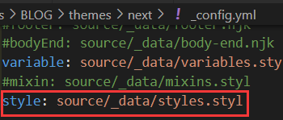

### 一、标签页美化

1. 在 `themes/next/layout/` 目录下面新建 `tag-color.njk` 填入以下内容<!--more-->

   ```stylus
   <script type="text/javascript">
        var alltags = document.getElementsByClassName('tag-cloud-tags');
        var tags = alltags[0].getElementsByTagName('a');
        for (var i = tags.length - 1; i >= 0; i--) {
          var r=Math.floor(Math.random()*75+130);
          var g=Math.floor(Math.random()*75+100);
          var b=Math.floor(Math.random()*75+80);
          tags[i].style.background = "rgb("+r+","+g+","+b+")";
        }
   </script>
   <style>
     .tag-cloud-tags{
       /*font-family: Helvetica, Tahoma, Arial;*/
       /*font-weight: 100;*/
       text-align: center;
       counter-reset: tags;
     }
     .tag-cloud-tags a{
       border-radius: 6px;
       padding-right: 5px;
       padding-left: 5px;
       margin: 8px 5px 0px 0px;
     }
     .tag-cloud-tags a:before{
       content: "🔖";
     }
   
     .tag-cloud-tags a:hover{
        box-shadow: 0px 5px 15px 0px rgba(0,0,0,.4);
        transform: scale(1.1);
        /*box-shadow: 10px 10px 15px 2px rgba(0,0,0,.12), 0 0 6px 0 rgba(104, 104, 105, 0.1);*/
        transition-duration: 0.15s;
     }
   </style>
   ```
   

   
2. 在 `themes/next/layout/_partials/page/tags.njk` 中引入该文件 +

   ```stylus
   <div class="tag-cloud">
     <div class="tag-cloud-title">
       {{ _p('counter.tag_cloud', site.tags.length) }}
     </div>      
     <div class="tag-cloud-tags">
       {{ tagcloud({
         min_font: theme.tagcloud.min,
         max_font: theme.tagcloud.max,
         amount  : theme.tagcloud.amount,
         orderby : theme.tagcloud.orderby,
         order   : theme.tagcloud.order,
         class   : 'tag-cloud'
         })
       }}
   +   
     </div>
   </div>
   ```

   

### 二、文章底部标签美化

在 `blog/source/_date/styles.styl` 中增加如下内容，没有该文件需要自己新建，并且打开主题配置文件中对该文件的注释行

```stylus
/*文章底部标签样式*/
.posts-expand .post-tags a {
  -webkit-box-shadow: 0 1px 3px rgba(0, 0, 0, .12), 0 1px 2px rgba(0, 0, 0, .24);
  -moz-box-shadow: 0 1px 3px rgba(0, 0, 0, .12), 0 1px 2px rgba(0, 0, 0, .24);
  box-shadow: 0 1px 3px rgba(0, 0, 0, .12), 0 1px 2px rgba(0, 0, 0, .24);
  font-family: 'Comic Sans MS', sans-serif;
  transition: .2s ease-out;
  padding: 3px 5px;
  margin: 5px;
  background: #f5f5f5;
  border-bottom: none;
  border-radius: 15px;

  +mobile(){
    padding: 1px 3px;
    font-size: 8px;
  }

  &:hover {
    background: rgba(100,154,182,0.902);
    color: #fff;
    -webkit-box-shadow: 0 8px 16px 0 rgba(0,0,0,0.2), 0 6px 20px 0 rgba(0,0,0,0.19);
    -moz-box-shadow: 0 8px 16px 0 rgba(0,0,0,0.2), 0 6px 20px 0 rgba(0,0,0,0.19);
    box-shadow: 0 8px 16px 0 rgba(0,0,0,0.2), 0 6px 20px 0 rgba(0,0,0,0.19);
  }
}
```




### 三、归档页美化

修改 `themes/next/layout/_macro/post-collapse.njk` 为如下

```stylus




  

  
    
    <div class="collection-year">
      <h2h1 class="collection-header">{{ current_year }}</h2h1>
    </div>
  

  <article class="my-post post-type-{{ post.type | default('normal') }}" itemscope itemtype="http://schema.org/Article">
    <header class="my-post-header">

      <div class="my-post-meta">
        <time class="my-post-time" itemprop="dateCreated"
              datetime="{{ moment(post.date).format() }}"
              content="{{ date(post.date, config.date_format) }}">
          {{ date(post.date, 'MM-DD') }}
        </time>
      </div>

      <h3h2 class="my-post-title">
        {# Link posts #}
          <a class="my-post-title-link post-title-link-external" target="_blank" href="{{ url_for(post.link) }}" itemprop="url">
            {{ post.title or post.link }}
            <i class="fa fa-external-link"></i>
          </a>
        
          <a class="my-post-title-link" href="{{ url_for(post.path) }}" itemprop="url">
            
              {{ post.content }}
            
              <span itemprop="name">{{ post.title or __('post.untitled') }}</span>
            
          </a>
        
      </h3h2>

    </header>
  </article>



```

在 `blog/source/_data/styles.styl` 中增加

```
/* 归档页样式 began */
.page-archive .archive-page-counter {
  font-size: 18px;
  background-color: rgb(20, 90, 140);
  padding-left: 10px;
  padding-right: 10px;
  border-radius: 8px;
  color: #fff;
  +mobile() {
    font-size: 16px;
  }
}
.my-post-time{
  font-size: 11px;
  position: absolute;
  color: #fff;
  background-color: rgb(20, 90, 140);
  border-radius: 5px;
  padding-left: 5px;
  padding-right: 5px;
  margin-left: 15px;
}
.mypost{
  position: relative;
  margin-bottom: 1rem;
  -webkit-transition: all .2s ease-in-out;
  -moz-transition: all .2s ease-in-out;
  -o-transition: all .2s ease-in-out;
  -ms-transition: all .2s ease-in-out;
  transition: all .2s ease-in-out;
}
a.my-post-title-link:before{
  top: 10px;
  width: 18px;
  height: 18px;
  content: "📚";
  margin-right: 5px;
  font: normal normal normal 14px/1 FontAwesome;
  font-size: 15px;
  line-height: 18px;
}
a.my-post-title-link{
  text-decoration: none;
  font-size: 15px;
  font-weight: 400;
  +mobile() {
    font-size: 14px;
  }
}
.my-post-title{
  display: block;
  margin-left: 4.5rem;
  color: #4c4948;
  text-decoration: none;
  font-size: .8rem;
  cursor: pointer;
  +mobile() {
    //margin-left: 4rem;
  }
}
.my-post-header{
  position: top;
  margin-bottom: 1rem;
  -webkit-transition: all .2s ease-in-out;
  -moz-transition: all .2s ease-in-out;
  -o-transition: all .2s ease-in-out;
  -ms-transition: all .2s ease-in-out;
  transition: all .2s ease-in-out;
}
//.my-post-title-link{
//  font-size: 16px;
//  font-weight: 500;
//}
.my-post-meta{
  position: absolute;
  color: #99a9bf;
  width: 80px;
  color: #114142;
}
div.post-block.tag .collection-title h2 {
  border-width: 1px;
  border-style: solid;
  border-color: #3f3f3f;
  border-radius: 20px;
  font-size: 22px;
  background-color: #b4e8fa;
  padding: 2px 15px;
  letter-spacing: 1.5px;
  box-sizing: border-box;
  color: #3f3f3f;
  display: inline-block;
  margin: 10px 0 10px;
  text-align: center;
  +mobile(){
    font-size: 18px;
  }
}
/* 归档页样式 end */
```


### 参考

[Hexo+NexT博客归档/标签/分类页美化 | CodeHeap (gitee.io)](https://jrbcode.gitee.io/posts/be9758cd.html)