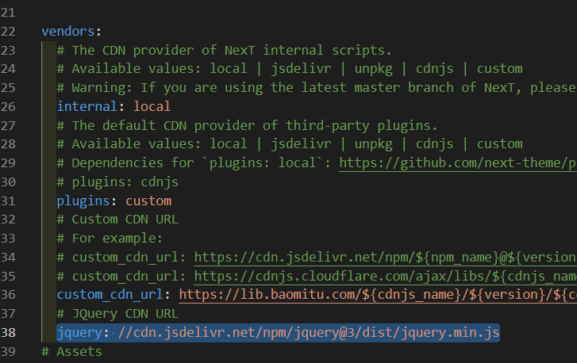

### 问题

使用Next主题的Hexo博客，在进行个性化配置时，可能出现

```stylus
Uncaught ReferenceError: $ is not defined`
```

这是由于使用的插件引用了 `JQuery`　但是我们没有导入。

<!--more-->

### 方法

在Next的主题配置文件 `_config.yml` 中，找到

```stylus
vendors:
```

在下面增加一行，即可导入。

```stylus
jquery: //cdn.jsdelivr.net/npm/jquery@3/dist/jquery.min.js
```

