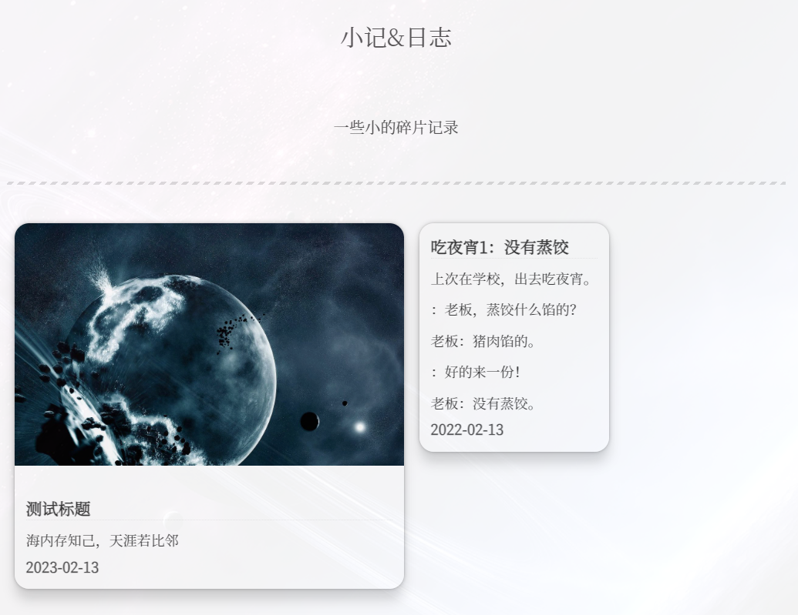

### 一、作用

用于记录一些小的，无法成篇的小碎片。为在线编辑提供一个入口。

### 二、实现

首先新建一个 `page` <!--more-->

```shell
hexo n page write
```

这样子我们在 `blog/source` 文件夹下面就得到一个 `write` 文件夹，同时里面有一个 `index.md` 。只需要编辑该文件即可配置小记页面。

在小记页面采取了 `html` 格式书写，方便自定义一些样式。在 `write` 文件夹下新建 `card.css` 作为样式文件。

```html
<div style="text-align: center">一些小的碎片记录</div>

---

<head>
    <link rel="stylesheet" type="text/css" href="card.css">
</head>

<body><div>
<!--start-->
<div class="card" draggable="true"  scale="true">

<div class="card-text">
<h3>测试标题</h3>
<span>海内存知己，天涯若比邻</span>
<h4>2023-02-13</h4>
</div></div>

<div class="card" draggable="true" >
<div class="card-text">
<h3>吃夜宵1：没有蒸饺</h3>
<span>上次在学校，出去吃夜宵。<br>：老板，蒸饺什么馅的？<br>老板：猪肉馅的。<br>：好的来一份！<br>老板：没有蒸饺。</span>
<h4>2022-02-13</h4>
</div></div>

<!--end-->
</div></body>
```

效果如下，增加 `card` 的数量就可以继续增加卡片。



`card.css` 文件主要内容如下，`card` 元素的  `scale="true"` 意味着图像等比缩小，不加此参数则独占一行。

```css
.card {
    display: inline-block;
    vertical-align: top;    
    background: rgba(255,255,255,0.7);
    box-shadow: 0 0 2px 0 rgba(0, 0, 0, .15), 0 0 4px 0 rgba(0, 0, 0, .2), 0 12px 12px 0 rgba(0, 0, 0, .15);
    margin: 0rem 0.5rem 2.5rem 0.5rem;
    transition: box-shadow .2s ease-in-out;
    border-radius: 15px;
    overflow: hidden;
}
.card[draggable=true] {
    cursor: move;
}
.card[draggable=false] {
    cursor: not-allowed;
}
.card[scale=true] {
    width: 50%;
}
.card:hover {
    box-shadow: 0 0 18px 0 rgba(0, 0, 0, .1), 0 0 36px 0 rgba(0, 0, 0, .15), 0 36px 36px 0 rgba(0, 0, 0, .2);
}
.card > img {
    padding: 0;
    margin: 0;
}
.card-text {
    padding: 0.75rem;
}
.card-text > h3 {
    margin: 0 0 0.25rem 0;
    font-size: 1.05rem;
    line-height: 1.5rem;
    font-weight: 600;
    cursor: pointer;
    transition: color .2s ease-in-out;
    color: rgba(10,10,10,0.8);
}
.card-text > h3:hover {
    color: rgb(28, 87, 127);
}
.card-text > span {
    margin: 0;
    font-size: 0.9rem;
    line-height: 1rem;
    font-weight: 200;
    color: rgba(10,10,10,0.8);
}

.card-text > h4 {
    margin: 0 0 0 0;
    font-size: 0.95rem;
    color: rgba(10, 10, 10, 0.7);
}
```

