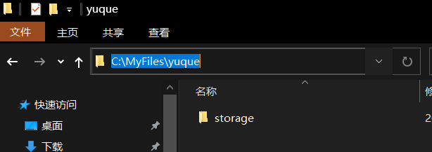

### 背景

之前说过原先的GitHub Pages的博客源码由于重装系统丢失，最近比较闲，想要重新搭建，因此希望能够将语雀知识库导出，但是只能导出lakebook格式，不能满足要求，于是有了这个摸索。

<!--more-->

### 操作

1. 安装nodejs，参考 [Node.js 安装以及更新](https://yu-qi-hang.gitee.io/posts/ccc6aa86) 要求 Node.js 16.18.0 以上版本。
2. `win+r`呼出运行，输入`cmd`回车，运行下面代码安装小工具。

```bash
npm i -g yuque-exporter --registry=https://registry.npmmirror.com
```

3. [获取语雀token](https://link.zhihu.com/?target=https%3A//www.yuque.com/yuque/developer/api%23785a3731) 并且设置，注意 `<your_token>`用自己获取的token替换。

```bash
set YUQUE_TOKEN=<your_token>
```

4. 在自己希望存放文件的文件夹下点击资源管理器路径输入**cmd** 回车打开终端，运行下面代码

```bash
yuque-exporter
```

5. 之后就会自动完成文章拉取，如果在文档下面又子文档，那么该文档会变成一个文件和一个文件夹。图片会全部存放哎asset文件夹之内。站外的卡片和标题不会显示，推荐全部使用链接的形式。站内的引用会自动变成链接。

### 参考

1. [语雀知识库一键导出 Markdown 工具](https://zhuanlan.zhihu.com/p/582287220)
